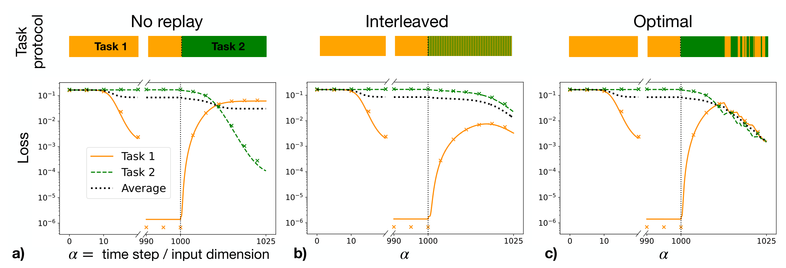

+++

title = "论文阅读：连续学习的最优控制方式"

date = "2025-08-15"

[taxonomies]

tags = ["Machine Learning", "Continual Learning", "Optimal Control"]

+++

> Original Paper: [Optimal Protocols for Continual Learning via Statistical Physics and Control Theory](https://www.123865.com/s/plj7Vv-fvR23)

> 概述：本篇文章介绍了如何使用最优控制理论调整连续学习中的 Replay 任务、学习率使得最终的 generalization error 最低。

## Introduction

**Multi-Task Learning**: Training a neural network on a series of tasks.

**Catastrophic Forgetting**: Multi-task learning can lead to catastrophic forgetting, where learning new tasks degrades performance on older ones.

**Replay**: Present the network with examples from the old tasks while training on the new one to minimize forgetting.

---

## A Teacher-Student Framework

**Teacher-Student Framework**: Here we consider a teacher-student framework

- Student: The student network is trained on synthetic inputs $\boldsymbol{x} \in \mathbb{R}^N$, drawn i.i.d. from a standard Gaussian distribution $x_i \sim \mathcal{N}(0, 1)$. It is a two-layer neural network with $K$ hidden units, first-layer weight $\boldsymbol{W} = (\boldsymbol{w}_1,\cdots,\boldsymbol{w}_K)^{\top} \in \mathbb{R}^{K \times N}$, activation function $g$, and second-layer weights $\boldsymbol{v} \in \mathbb{R}^K$. It outputs the prediction

  $$
  \hat{y}(\boldsymbol{x}; \boldsymbol{W}, \boldsymbol{v}) = \sum\limits_{k = 1}^K g \left( \frac{\boldsymbol{x} \cdot \boldsymbol{w}_k}{\sqrt{N}} \right).
  $$
- Teacher: The labels for each task $t = 1,2,\cdots, T$ are generated by the teacher networks, $y^{(t)} = g_{\ast}(\boldsymbol{x} \cdot \boldsymbol{w}_{\ast}^{(t)}/\sqrt{N})$, where $\boldsymbol{W}_{\ast} = (\boldsymbol{w}_{\ast}^{(1)},\cdots,\boldsymbol{w}_{\ast}^{(T)})^{\top} \in \mathbb{R}^{T \times N}$ denote the corresponding teacher vectors, and $g_{\ast}$ the activation function.
- Task-Dependent Weights: We allow for task-dependent readout weights $\boldsymbol{V} = (\boldsymbol{v}^{(1)},\cdots,\boldsymbol{v}^{(T)})^{\top} \in \mathbb{R}^{T \times K}$. Specifically, when the task $t$ is presented, the readout is switched to the corresponding task, the first-layer weights are shared across tasks.

 A student network is trained on i.i.d. inputs from two teacher networks, defining two different tasks; (b) Sequential training results in catastrophic forgetting.")

**Generalization Error**: The generalization error of the student on task $t$ is given by

$$
\varepsilon_t(\boldsymbol{W}, \boldsymbol{V}, \boldsymbol{W}_*) := \frac{1}{2} \left\langle \left( y^{(t)} - \hat{y}^{(t)} \right)^2 \right\rangle = \frac{1}{2} \mathbb{E}_{\boldsymbol{x}} \left[ \left( g_* \left( \frac{\boldsymbol{w}_*^{(t)} \cdot \boldsymbol{x}}{\sqrt{N}} \right) - \hat{y}(\boldsymbol{x}; \boldsymbol{W}, \boldsymbol{v}^{(t)}) \right)^2 \right].
$$

where $(\boldsymbol{x}, y^{(t)})$ is a sample, $\hat{y}^{(t)}$ is the prediction, the angular brackets $\langle \cdot \rangle$ denote the expectation over the input distribution.

**Overlaps Variables**: The above generalization error depends only through the preactivations

$$
\lambda_k := \frac{\boldsymbol{x} \cdot \boldsymbol{w}_k}{\sqrt{N}}, \quad k = 1, \ldots, K, \qquad \text{and} \qquad \lambda_*^{(t)} := \frac{\boldsymbol{x} \cdot \boldsymbol{w}_*^{(t)}}{\sqrt{N}}, \quad t = 1, \ldots, T.
$$

They define jointly Gaussian variables with zero mean and second moments given by

$$
\begin{aligned}
&M_{kt} := \mathbb{E}_{\boldsymbol{x}} \left[ \lambda_k \lambda_*^{(t)} \right] = \frac{\boldsymbol{w}_k \cdot \boldsymbol{w}_*^{(t)}}{N} , \\
&Q_{kh} := \mathbb{E}_{\boldsymbol{x}} \left[ \lambda_k \lambda_h \right] = \frac{\boldsymbol{w}_k \cdot \boldsymbol{w}_h}{N} , \\
&S_{tt'} := \mathbb{E}_{\boldsymbol{x}} \left[ \lambda_*^{(t)} \lambda_*^{(t')} \right] = \frac{\boldsymbol{w}_*^{(t)} \cdot \boldsymbol{w}_*^{(t')}}{N} ,
\end{aligned}
$$

called *overlaps* in the statistical physics literature. Therefore, the dynamics of the generalization error is entirely captured by the evolution of the readouts $\boldsymbol{V}$ and the overlaps.

**Forward Training Dynamics**: We use the shorthand notation $\mathbb{Q} = (\operatorname{vec}(\boldsymbol{Q}), \operatorname{vec}(\boldsymbol{M}), \operatorname{vec}(\boldsymbol{V})) \in \mathbb{R}^{K^2 + 2KT}$. The training dynamics is described by a set of ODEs

$$
\frac{\mathrm{d}\mathbb{Q}(\alpha)}{\mathrm{d}\alpha} = f_{\mathbb{Q}}(\mathbb{Q}(\alpha), \boldsymbol{u}(\alpha)), \quad \alpha \in (0, \alpha_F].
$$

The parameter $\alpha$ denotes the effective training time, and $\boldsymbol{u}$ is the control variable.

---

## The Optimal Control Framework

**Optimal Control Framework**: Our goal is to derive training strategies that are optimal with respect to the generalization performance *at the end of the training* and on *all tasks*. In practice, we minimize a linear combination of the generalization errors on different tasks

$$
h(\mathbb{Q}(\alpha_F)) := \sum\limits_{t = 1}^T c_t \epsilon_t(\mathbb{Q}(\alpha_F)), \quad \text{with} \quad c_t \geq 0, \sum\limits_{t = 1}^T c_t = 1.
$$

where $\alpha_F$ is the final training time, the coefficients $c_t$ identify the relative importance of different tasks and $\epsilon_t$ denotes the infinite-dimensional limit of the average generalization error on task $t$. We define the cost functional

$$
\mathcal{F}[\mathbb{Q}, \hat{\mathbb{Q}}, \bm{u}] = h\left(\mathbb{Q}(\alpha_F)\right) + \int_0^{\alpha_F} \mathrm{d}\alpha \, \hat{\mathbb{Q}}(\alpha)^\top \left[ -\frac{\mathrm{d}\mathbb{Q}(\alpha)}{\mathrm{d}\alpha} + f_{\mathbb{Q}}\left(\mathbb{Q}(\alpha), \bm{u}(\alpha)\right) \right],
$$

Here $\hat{\mathbb{Q}} = (\operatorname{vec}(\hat{\boldsymbol{Q}}), \operatorname{vec}(\hat{\boldsymbol{M}}), \hat{\operatorname{vec}(\boldsymbol{V}}))$ is the conjugate order parameters (We can consider it as a Lagrange multiplier that incorperates the dynamics of $\mathbb{Q}$).

**Backward Conjugate Dynamics**: 

‍

‍
