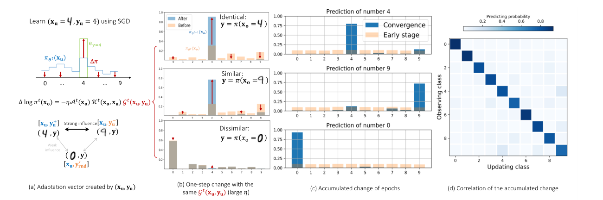

+++

title = "神经正切核 Neural Tangent Kernel, NTK"

date = "2025-09-28"

[taxonomies]

tags = ["Machine Learning", "Fine Tuning"]

+++

在文章 [[2407.10490] Learning Dynamics of LLM Finetuning](https://arxiv.org/abs/2407.10490) 中我们接触到了神经正切核的概念，其刻画了不同数据对参数、Logits 的影响。

---

## 问题回顾

**分类问题**：我们考虑多分类问题，将输入 $\mathbf{x}$ 映射至 $\mathbf{y} \in \mathcal{V}$，其中 $\mathcal{V}$ 是大小为 $V$ 的字典。模型会先输出 logits $\mathbf{z} = h_\theta(\mathbf{x}) \in \mathbb{R}^V$，然后取 Softmax：

$$
\mathbf{x}
    \xrightarrow{\text{Hidden Layers}}
    \underbrace{
    \mathbf{z} = h_{\theta}(\mathbf{x}) =
    \begin{bmatrix}
      z_1\\ z_2 \\ \vdots \\ z_V
    \end{bmatrix}}_{\text{logits}}
    \xrightarrow{\text{Softmax}}
    \underbrace{
    \begin{bmatrix}
      \pi_{\theta}(y_1\mid \mathbf{x})\\
      \pi_{\theta}(y_2\mid \mathbf{x})\\
      \vdots\\
      \pi_{\theta}(y_V\mid \mathbf{x})
    \end{bmatrix}}_{\text{confidence}}.
$$

**学习样本的 Dynamics**：考虑学习新样本 $(\mathbf{x}_u, \mathbf{y}_u)$，学习率为 $\eta$，通过在 $\mathbf{x}_u$ 上进行一次梯度下降，模型在 $\mathbf{x}_o$ 上预测的变化值：

$$
\Delta \log \pi^t(\mathbf{y} \mid \mathbf{x}_o) := \log \pi_{\theta^{t+1}}(\mathbf{y} \mid \mathbf{x}_o) - \log \pi _{\theta^t}(\mathbf{y} \mid \mathbf{x}_o).
$$

**Learning Dynamics**：单步的 Learning Dynamics 为

$$
\underbrace{\Delta \log \pi^t(\mathbf{y} \mid \mathbf{x}_o)}_{V \times 1} = -\eta \underbrace{\mathcal{A}^t(\mathbf{x}_o)}_{V \times V} \underbrace{\mathcal{K}^t(\mathbf{x}_o, \mathbf{x}_u)}_{V \times V} \underbrace{\mathcal{G}^t(\mathbf{x}_u, \mathbf{y}_u)}_{V \times 1} + \mathcal{O}\bigl(\eta^2 \|\nabla_\theta \mathbf{z}(\mathbf{x}_u)\|_{\text{op}}^2\bigr),
$$

- $\mathcal{A}^t = \nabla_{\mathbf{z}} \log \pi_{\theta^t}(\mathbf{x}_o) = I - \mathbf{1} \pi^{\top}_{\theta^t}(\mathbf{x}_o)$ 将 logits 中的变化 $\Delta \mathbf{z}$ 映射到输出分布 $\log \pi (\mathbf{y} \mid \mathbf{x}_o)$，即对应着 Softmax 的矩阵表达；
- $\mathcal{K}^t(\mathbf{x}_o, \mathbf{x}_u) = (\nabla_{\theta}\mathbf{z}(\mathbf{x}_o)\mid_{\theta^t})(\nabla_{\theta}\mathbf{z}(\mathbf{x}_u)\mid_{\theta^t})^{\top}$ 衡量了 $\mathbf{x}_o$ 和 $\mathbf{x}_u$ 的相互影响程度；
- $\mathcal{G}^t(\mathbf{x}_u, \mathbf{y}_u) = \nabla_{\mathbf{z}}\mathcal{L}(\mathbf{x}_u, \mathbf{y}_u)\mid_{\mathbf{z}^t}$ 从当前分布指向期望的分布，即误差信号。

​

---

## 神经正切核的理解

$\nabla_\theta \mathbf{z}(\mathbf{x})$ **的理解**：$\mathbf{z}(\mathbf{x}) \in \mathbb{R}^V$ 是模型对输入 $\mathbf{x}$ 输出的 logits 向量，$\theta \in \mathbb{R}^P$ 是模型所有参数构成的向量，因此 $\nabla_\theta \mathbf{z}(\mathbf{x})$ 是 $\mathbf{z}(\mathbf{x})$ 关于 $\theta$ 的 <u>Jacobian Matrix</u>：

$$
\nabla_\theta\mathbf{z}(\mathbf{x})=
\begin{bmatrix}
\frac{\partial z_1}{\partial\theta_1} & \frac{\partial z_1}{\partial\theta_2} & \ldots & \frac{\partial z_1}{\partial\theta_P} \\
\frac{\partial z_2}{\partial\theta_1} & \frac{\partial z_2}{\partial\theta_2} & \ldots & \frac{\partial z_2}{\partial\theta_P} \\
\vdots & \vdots & \ddots & \vdots \\
\frac{\partial z_V}{\partial\theta_1} & \frac{\partial z_V}{\partial\theta_2} & \ldots & \frac{\partial z_V}{\partial\theta_P}
\end{bmatrix}.
$$

$\nabla_\theta \mathbf{z}(\mathbf{x})$ 的第 $i$ 行 $\nabla_\theta {z}_i(\mathbf{x})$ 表示了为了<u>使第 </u>​<u>$i$</u>​<u> 个 logit </u>​<u>$z_i$</u>​<u> 增长得最快，模型 </u>​<u>$\theta$</u>​<u> 应该更新的方向</u>。换而言之，<u>模型 </u>​<u>$\theta$</u>​<u> 对第 </u>​<u>$i$</u>​<u> 个 logit 的敏感度</u>。

**矩阵乘积的含义**：我们来分析 $\mathcal{K}$ 的第 $(i,j)$ 个元素，其是 $\nabla_\theta z_i(\mathbf{x}_o)$ 与 $\nabla_\theta z_j(\mathbf{x}_u)$ 的内积

$$
\mathcal{K}_{ij}=(\nabla_\theta z_i(\mathbf{x}_o))\cdot(\nabla_\theta z_j(\mathbf{x}_u))^\top=\sum_{p=1}^P\frac{\partial z_i(\mathbf{x}_o)}{\partial\theta_p}\frac{\partial z_j(\mathbf{x}_u)}{\partial\theta_p}
$$

- 向量 $\nabla_\theta z_i(\mathbf{x}_o)$ 是在参数空间 $\mathbb{R}^P$ 中，能够最有效提升【输入为 $\mathbf{x}_o$ 时第 $i$ 个类别的 logit 值】的方向；
- 向量 $\nabla_\theta z_j(\mathbf{x}_u)$ 是在参数空间 $\mathbb{R}^P$ 中，能够最有效提升【输入为 $\mathbf{x}_u$ 时第 $j$ 个类别的 logit 值】的方向。

**参数空间中的相似性**：$\mathcal{K}_{ij}$ 作为一个度量矩阵，其度量了两个方向在参数空间中的对齐程度或一致性

- 若 $\mathcal{K}_{ij}$ 为很大的正数：意味着那些能够有效提升 $z_i(\mathbf{x}_o)$ 的参数更新，同样也有效于提升 $z_j(\mathbf{x}_u)$；
- 若 $\mathcal{K}_{ij}$ 接近于 $0$：两个方向在参数空间正交，改变参数来影响 $z_i(\mathbf{x}_o)$ 对 $z_j(\mathbf{x}_u)$ 几乎没有影响，反之亦然；
- 若 $\mathcal{K}_{ij}$ 为很大的负数：两个方向是相反的，提升 $z_i(\mathbf{x}_o)$ 的参数更新会导致 $z_j(\mathbf{x}_u)$ 的下降。

**在 Learning Dynamics 中的作用**：$\mathcal{K}^t(\mathbf{x}_o, \mathbf{x}_u)$ 接收来自于 $\mathbf{x}_u$ 的误差信号 $\mathcal{G}^t$，并将其翻译为对 $\mathbf{x}_o$ 的 logits $\mathbf{z}(\mathbf{x}_o)$ 的影响
