+++

title = "论文阅读-Benchmarking Optimizers for Large Language Model Pretraining"

date = "2025-09-13"

[taxonomies]

tags = ["LLM", "Machine Learning"]

+++

> Original Paper: [[2509.01440] Benchmarking Optimizers for Large Language Model Pretraining](https://arxiv.org/abs/2509.01440)

---

## Introduction

**Chinchilla Scaling Law**: The optimal amount of training data for a given model size that yields the best performance under a fixed computational budget. To be more specific, we <u>need around 20 text tokens per parameter</u> (see [2203.15556](https://arxiv.org/pdf/2203.15556))

**Overview**: We discuss the algorithms according to their logical grouping:

- Adam-like methods: `AdamW`​, `ADOPT`​, `AdEMAMix`​
- Sign-based methods: `Lion`​, `Signum`​
- Approximate second-order optimizers: `Muon`​, `SOAP`​, `Sophia`​
- Learning rate/ scheduler-free learning algorithms: `Schedule-Free AdamW`​, `Prodigy`​
- MARS methods: `MARS`​

---

## Results at Small Scale: 124M Models

**Results with Small and Large Batches** and **Stability across Training Horizons**

 &quot;small&quot; batch size (b) &quot;large&quot; batch size.")​

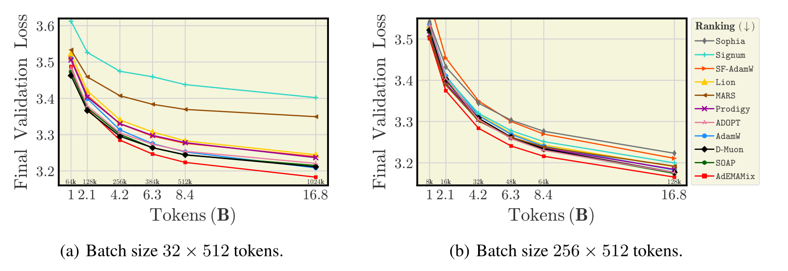​

> **Takeaway (Batch Size)**
>
> - `AdEMAMix`​ consistently achieves state-of-the-art performance and robust scaling with training duration.
> - Sign-based methods (`Signum`​, `Lion`​) and `MARS`​ greatly benefit from the <u>increased batch size</u>.
> - `Sophia`​ diverges in small-batch setting, when trained beyond the Chinchilla optimal horizon, even with sufficiently small learning rate;
> - `SOAP`​ show a consistent performance in both settings.
>
> **Takeaway (Stability)** : Once optimizers are properly re-tuned for the maximal length of training considered, doubling of number of iterations does not affect the ranking of methods.

---

**Increasing the Batch Size Further**:

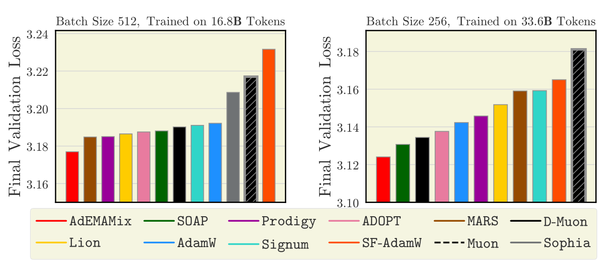​

> **Takeaway**: Many methods, especially `MARS`​, `Prodigy`​, and `sign-based`​ ones, can outperform `AdamW`​ while trained on a sufficiently large batches.

---

**Weight Decay Ablation**: 

 AdamW, Signum, Lion with large weight decay outperform baseline AdamW with weight decay of 0.1 for short training duration. (b) the setting without weight decay is suboptimal. (c) Smaller weight decay leads to larger L2 norm of the model parameter.")​

 D-Muon uses a weight decay for all parameters, (2) Muon uses weight decay only on embeddings, scalar parameters, and the final layer. We can see that D-Muon greatly outperforms the basic Muon.")​

> **Takeaway**:
>
> - The use of weight decay (particularly a large weight decay term 0.5 and above), can significantly impact the final loss and optimizer behavior.
> - The setting of weight decay to be $0$ is suboptimal.
> - For extended training horizons, non-zero weight of $0.1$ proves to be a robust option.

---

**Learning Rate Sensitivity**: 

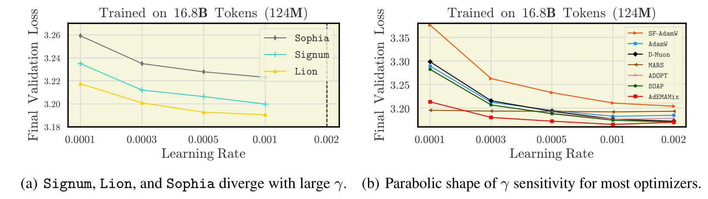​

> **Takeaway**:
>
> - For most optimizer, the learning rate $\gamma_{\max}$ selected near the Chinchilla optimal horizon transfers smoothly to $8 \times$longer run.
> - Sign-based methods and `Sophia`​ diverge with $\gamma_{\max} = 2e^{-3}$.
> - `MARS`​ demonstrates a very consistent performance across $\gamma$ sweep.

---

**Warmup Ablation**:

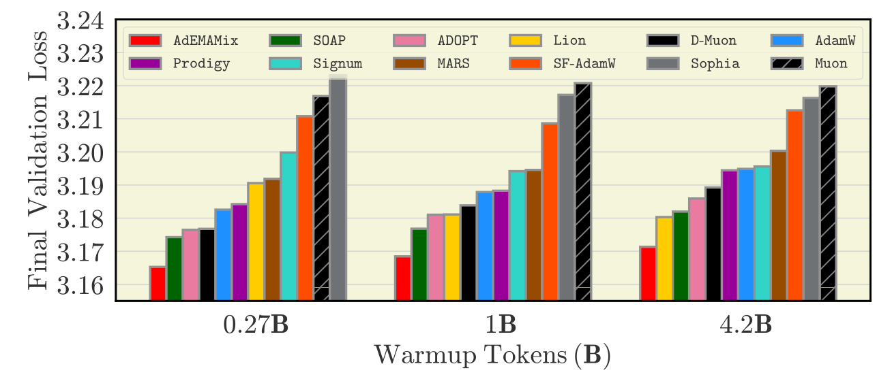​

> **Takeaway**: We reveal that the warmup duration is optimizer-dependent and should be tuned: for `SF-AdamW`​, `Sophia`​, and `Signum`​, longer warmup results in improved final performance.

---

**Warmup Types of WSD, cosine, and linear** **$\gamma$**​ **-scheduler**:

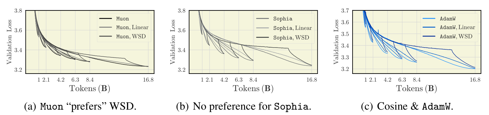​

 the gradient evolution for majority of optimizers resembles the SF-AdamW pattern (a,c) Exceptions are sign-based methods: Signum and Lion.")​

> **Takeaway**: A choice of the learning rate scheduler is also optimizer-related
>
> - For most methods, the cosine scheduler dominates.
> - Linear scheduler outperforms or matches cosine and WSD for sign-based methods, `SOAP`​ and `MARS`​.
> - WSD appears to be the best option for `Muon`​

---

## Results at Medium Scale: 210M Models

**Results**​

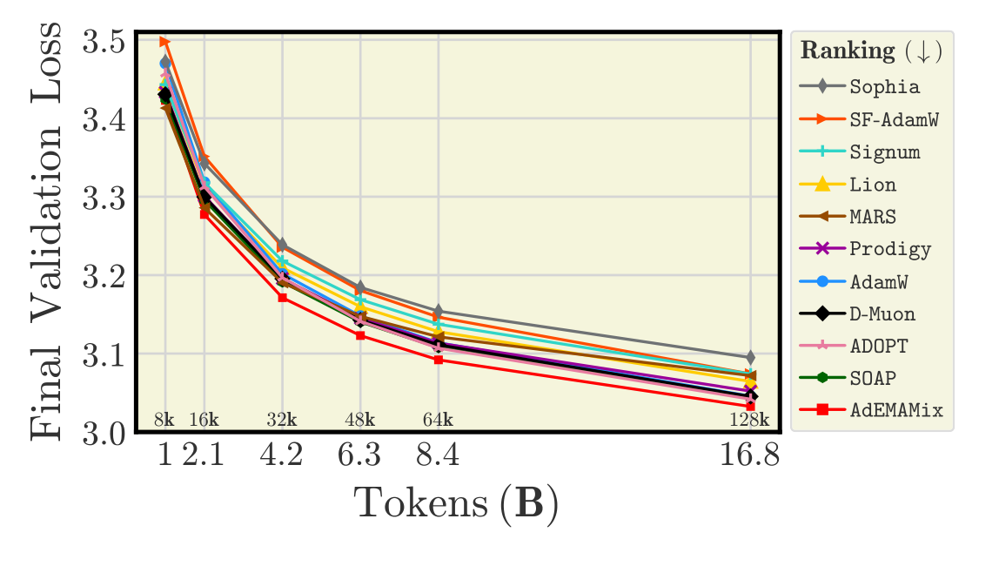​

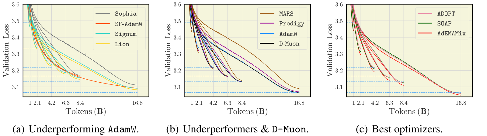​

> **Takeaway**:
>
> - We do not observe a much of a change in ranking of optimizers for 210M model, compared to benchmarking on 124M.
> - We replicated almost identical hyperparameters for all optimizers, except for the learning rate for sign-based methods (which is more sensitive to the learning rate while scaling the model size)

---

**Decay the learning rate sufficiently**

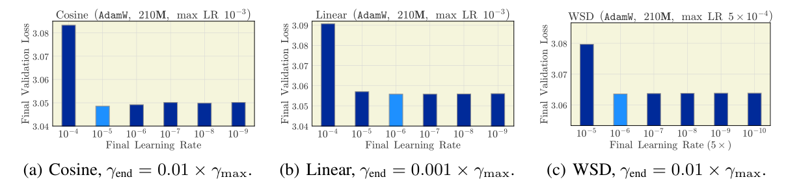​

> **Takeaway**: Decaying the learning rate further than $10\%$ of the maximal significantly improves the results. However, for different schedulers, the best final learning rate is different.

---

## Results at Large Scale: 583M and 720M Parameters

**Results**

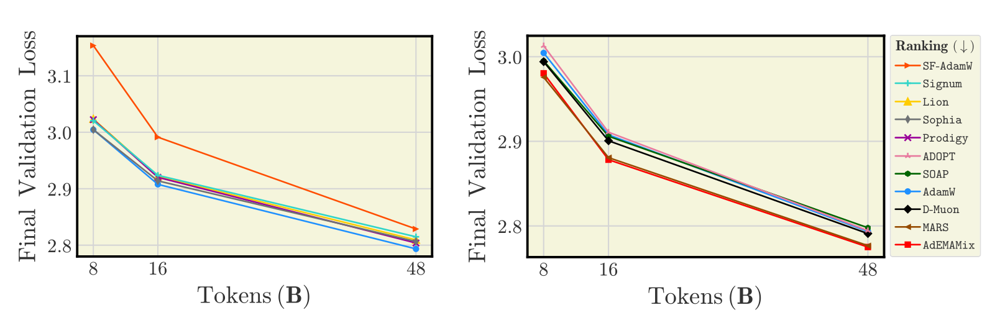​

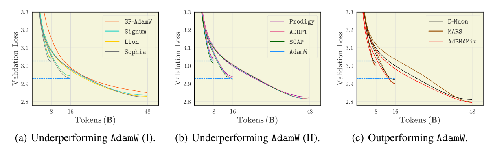​

> **Takeaway**:
>
> - At larger scale of model and batch size, `AdEMAMix`​ and `MARS`​ dominate.
> - Despite training with large batches, `Signum`​ and `Lion`​ scale poorly.
> - `D-Muon`​ is consistent across all our benchmarking setups.

---

**Wall-clock time comparison**​

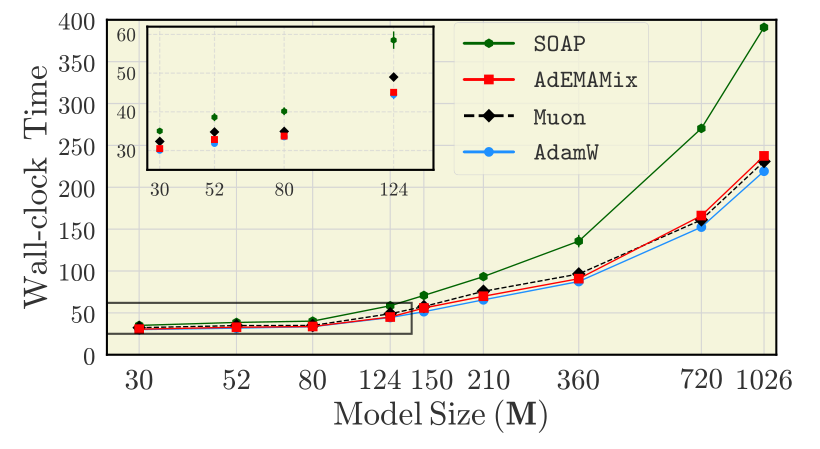​

> **Takeaway**: Most optimizers exhibit similar wall-time performance, with sign-based methods being slightly faster. `SOAP`​ is the main exception.

---

## Extension to MoEs

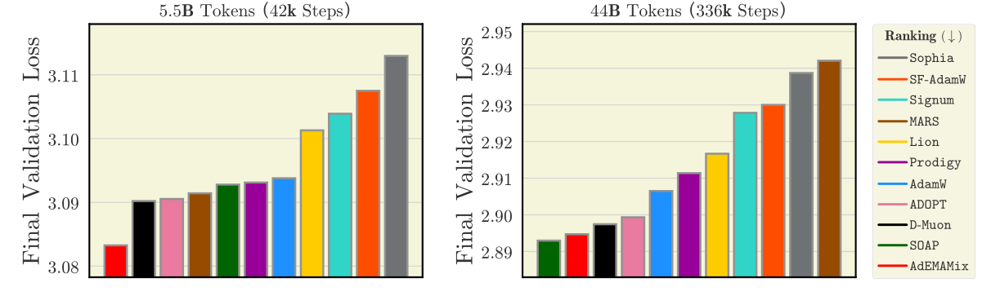​

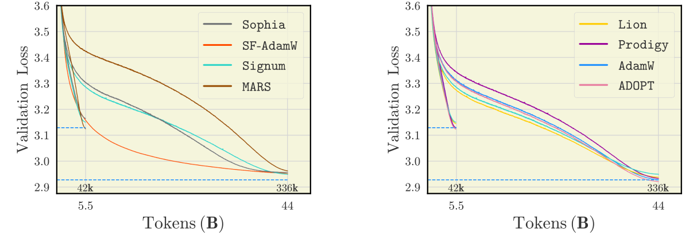​

> **Takeaway**: Benchmarking results obtained for dense models transfer to corresponding MoEs.

‍
