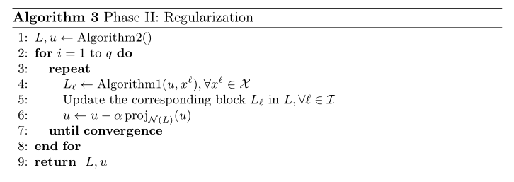

+++

title = "论文阅读：Control Theoretic Approach to Fine-Tuning and Transfer Learning"

date = "2025-09-24"

[taxonomies]

tags = ["Fine Tuning", "Catastrophic Forgetting"]

+++

> Original Paper: [[2404.11013] Control Theoretic Approach to Fine-Tuning and Transfer Learning](https://arxiv.org/abs/2404.11013)

---

## Preliminaries

**Hausdorff Space**: A topological space $(X, \mathcal{T})$ is said to be a *Hausdorff space* if

$$
\forall x,y\in X,x\neq y\Longrightarrow\exists U,V\in\mathcal{T}\mathrm{~s.t.~}x\in U,y\in V,\mathrm{~and~}U\cap V=\emptyset
$$

where $\mathcal{T}$ is the set of all the open sets in the space.

> Hausdorff 空间保证了点的可分离性。

**Basis of Topological Spaces**: The *basis* of a topological space $\mathcal{B}$ is a set of open sets satisfying

$$
\exists\mathcal{B}=\{B_1,B_2,B_3,\ldots\}\subseteq\mathcal{T}\mathrm{~s.t.~}\forall U\in\mathcal{T},U=\bigcup_{i\in I}B_i\text{ for some }I
$$

**Second-Countable**: A topological space $(X, \mathcal{T})$ is said to be *second countable* if $\mathcal{T}$ has a countable basis.

**Homeomorphism**: A mapping $\phi: U \to V$ is *homeomorphism* if both $\phi$ and $\phi^{-1}$ are continuous mapping.

**Locally Euclidean and Chart**: A topological space $X$ is said to be *locally Euclidean* if for any $p \in X$, there exists an open neighbor $U$ of $p$, a open set $V \subseteq \mathbb{R}^n$, and a homeomorphism $\phi$ such that

$$
\phi: U \to V.
$$

Here $\phi$ is called the *chart*.

> 流形上每个局部都可以被坐标卡 chart 映射到一块 $\mathbb{R}^n$ 的区域

**Topological Manifold**: An $n$-dimensional *topological manifold* is a topological space that is Hausdorff, second-countable, and locally Euclidean of dimension $n$.

**Smooth Curve**: A *smooth curve* at a point $p$ on an manifold $M$ is a smooth map $\gamma: I \to M$, where $I \subseteq \mathbb{R}$ is an open interval containing $0$, such that $\gamma(0) = p$.

**Equivalence Relation on Curves**: Let $(U, \phi)$ be a local chart containing the point $p$, where $\phi: U \to \mathbb{R}^n$. Two smooth curves $\gamma_1$ and $\gamma_2$ at $p$ are said to be *equivalent* iff their velocity vectors in the chart coordinates are identical, that is

$$
\frac{\mathrm{d}}{\mathrm{d}t}(\phi\circ\gamma_1)(t)\bigg|_{t=0}=\frac{\mathrm{d}}{\mathrm{d}t}(\phi\circ\gamma_2)(t)\bigg|_{t=0}.
$$

> 可以理解为切平面上一个方向的曲线是等价的

**Tangent Vector**: A *tangent vector* $v$ at a point $p$ is an equivalence class of all smooth curves passing through $p$. We denote this as $v = [\gamma]$.

**Tangent Space**: The tangent space at a point $p$ on $M$, denoted by $T_pM$, is the set of all tangent vectors at $p$:

$$
T_pM:=\{[\gamma]\mid\gamma:I\to M\text{ is a smooth curve with }\gamma(0)=p\}
$$

---

## Problem Statement

**Dataset and System**: Consider the paired sets $(\mathcal{X},\mathcal{Y})=\{(x^{i},y^{i})\}_{i=1}^{q}$ in a connected Riemannian manifold $\mathcal{M}$​\, where elements of $\mathcal{X}$ are pairwise distinct. We take the system

$$
\dot{x}(t)=f(u(t), x(t)),
\quad u\in L_\infty([0,T],\mathbb{R}^{\bar{n}\times\bar{n}})
$$

$$
x^i\in\mathbb{R}^n
\overset{E}{\operatorname*{\longrightarrow}}
\bar{x}^i\in\mathbb{R}^{\bar{n}}
\overset{\varphi_T(u,\cdot)}{\operatorname*{\longrightarrow}}
\bar{y}^i\in\mathbb{R}^{\bar{n}}
\overset{R}{\operatorname*{\longrightarrow}}
y^i\in\mathbb{R}^{n_o}
$$

where $E: \mathbb{R}^n \to \mathbb{R}^{\bar{n}}$ is an embedding function, $R: \mathbb{R}^{\bar{n}} \to \mathbb{R}^n$ is a readout function, $\bar{n}$ is the embedding dimension, $n_o$ is the output dimension, and $\varphi_t(u,\cdot)$ is the map generated by the control function $u$. For simplicity, we assume that $n = \bar{n}$, and let $R$ be the orthogonal projection, that is

$$
R:x\in\mathbb{R}^n\mapsto Cx\in\mathbb{R}^{n_o}, 
\quad
\text{where} \quad C=[O_{n_{o}\times n-n_{o}}I_{n_{o}\times n_{o}}]\in\mathbb{R}^{n_{o}\times n}.
$$

> If $n = n_o$ and $R$ is the identity map, then we call the problem the control <u>with fixed end-points</u>（固定终值条件）. Otherwise, control with <u>partially constrained end-points</u>（终值约束条件）.

**Objective (Memorization Property)** : The control $u$ is said to have memorized the ensemble $(\mathcal{X}, \mathcal{Y})$ if the following holds for a finite $T \geq 0$: 

$$
R(\varphi_T(u,E(x^i)))=y^i, \quad \forall x^i\in\mathcal{X}.
$$

> 我们的总目标就是找到一个控制信号 $u$，对任意数据都能满足 memorization property。

**Cost Functional**: We define per-sample cost functional for a given point $x^i$ as

$$
\mathcal{J}^i(u)=\frac{1}{2}\|C\varphi(u,x^i)-y^i\|^2.
$$

Then, the cost-functional for the entire ensemble is

$$
\mathcal{J}(u,\mathcal{X}):=\sum_{i=1}^{q}\|C\varphi(u,x^{i})-y^{i}\|^{2}+\lambda\int_{0}^{T}\|u(\tau)\|^{2}d\tau.
$$

where $\lambda$ is some regularization coefficient.

**q-Folded Method**: Suppose $\mathcal{X}$ contains $q$ data points. Stack all the points in $\mathcal{X}$ into a vector of dimension $nq$ denoted by $X_0$, and the stacked outputs by $Y$. The minimization problem is 

$$
\mathcal{J}(u,X_0):=\|\Lambda(C)\vec{\varphi}_T(u,X_0)-Y\|^2+\int_0^T\|u(\tau)\|^2d\tau.
$$

$$
\text{subject to} \quad \dot{X}(t)=F(u(t),X(t)), \quad X(0)=X_0.
$$

where $\Lambda(C):=\mathrm{diag}(C,\cdots,C)\in\mathbb{R}^{n_{0}q\times nq}$, and $F$ is the dynamics created by copying $f$ $q$-times.

> 使用 q-folded method 求解非常困难。

---

## Existence of a Control Function

**Lie Bracket**: Let $g_1$ and $g_2$ be differentiable vector fields in $\mathcal{M} \subset \mathbb{R}^n$\, we call the *Lie bracket* of $g_1$ and $g_2$ the vector field:

$$
[g_1,g_2](x):=\frac{\partial g_2(x)}{\partial x}g_1(x)-\frac{\partial g_1(x)}{\partial x}g_2(x), \quad \mathrm{for} \quad x\in\mathcal{M}
$$

> Lie bracket 的核心含义：测量路径的不闭合程度，沿着以下两种路径：(1) 先 $g_1$ 走 $\epsilon$，再 $g_2$ 走 $\epsilon$；(2) $g_2$ 走 $\epsilon$，再 $g_1$ 走 $\epsilon$。两种路线到达的终点距离为：
>
> $$
> \epsilon^2\left(\frac{\partial g_2(x)}{\partial x}g_1(x)-\frac{\partial g_1(x)}{\partial x}g_2(x)\right).
> $$

**Maneuver Set**: Let $\mathcal{F}^0=\{f(x,u)|u\in L_\infty([0,T],\mathbb{R}^{n\times n})\}$ be the maneuver set with all the feasible control functions, and recursively define

$$
\mathcal{F}^k=\mathcal{F}^{k-1}\cup\left\{[g_i,g_j](x)\mid g_i,g_j\in\mathcal{F}^{k-1}\right\}.
$$

> $\mathcal{F}$ 是中的元素是关于 $x$ 的函数
>
> - $\mathcal{F}^0$：$u$ 可以是任意矩阵，此时每个 $u$ 对应一种运动模式 $g_i(x)$，因此 $\mathcal{F}^0$ 包含了所有的<u>直接运动方式</u>（但是不能组合不同运动模式）。
> - $\mathcal{F}^k$：在 $\mathcal{F}^{k-1}$ 的运动模式基础上进一步进行组合（例如快速交替执行它们），如果这种组合产生了一种新的运动模式，则加入动作库。
>
> 这种方式一般适用于 $f$ 是**非线性**的情况，否则直接组合 $u$ 即可。

**Control Distribution**: The corresponding distributions at point $x \in \mathbb{R}^n$ are

$$
\mathcal{D}_{x}^{k}(\mathcal{F})=\mathrm{span}\left\{g(x)\mid g\in\mathcal{F}^{k}\right\}.
$$

We can see that $\mathcal{D}_{x}^{k}(\mathcal{F})$ satisfies $\mathcal{D}_{x}^{k}(\mathcal{F})\subseteq\mathcal{D}_{x}^{k+1}(\mathcal{F})$. 

> $\mathcal{D}_{x}^{k}(\mathcal{F})$ 表示从 $x$ 出发，从 $\mathcal{F}^k$ 动作库中取一个动作，能达到的集合。

**Bracket-Generating**: We call $\mathcal{F}$ *bracket-generating* if $\mathcal{D}_x^\infty (\mathcal{F})$ spans $T_xE(\mathcal{M})$ for all $x \in E(\mathcal{M})$. Here $E$ is the embedding function and $T_x$ represents the tangent space.

> $T_xE(\mathcal{M})$ 表示了所有可能的运动方向，因此 bracket-generating 表示了我们的控制可以控制往任何方向。

**q-Folded Statement**: Assume $\mathcal{X}$ contains finite pairwise distinct points, $n > n_o$, $R(x) = Cx$. If $\tilde{\mathcal{F}}$ is bracket-generating in $E(\mathcal{M})^{(q)}$, then there exists $u$ and a finite time $T \geq 0$ such that the system memorizes $(\mathcal{X}, \mathcal{Y})$ by the control function $u$.

- Embedding space $E(\mathcal{M})^{q}:=E(\mathcal{M})\times\cdots\times E(\mathcal{M})$
- Ensemble $X=\left[E(x^1)^\top,\cdots,E(x^q)^\top\right]^\top\in E(\mathcal{M})^q \subseteq \mathbb{R}^{nq}$
- $\Delta^{q}:=\{[E(x^{1})^{\top},\cdots,E(x^{q})^{\top}]^{\top}\in E(\mathcal{M})^{q} | E(x^i)=E(x^j)\mathrm{~for~}i\neq j\}$
- Complement $E(\mathcal{M})^{(q)}:=E(\mathcal{M})^{q}\setminus\Delta^{q}$
- $\tilde{\mathcal{F}}^0=\{[f(u,x^1)^\top,f(u,x^2)^\top,\cdots,f(u,x^q)^\top]^\top\in\mathbb{R}^{nq}|u\in L_\infty([0,T],\mathbb{R}^{n\times n})\}.$

---

## Tuning without Forgetting

**Objective**: Let $\mathcal{X}^{j}=\{x^{i}\in\mathcal{X}|i=1,2,\cdots,j\}$, and $\mathcal{Y}^j$ the corresponding batch of labels. Denote $u^k$ the control function at the $k$th iteration. Assume that $u^k$ has memorized the ensemble $(\mathcal{X}^{j},\mathcal{Y}^{j})$. We propose an iterative method to find a control $u^\ast$ such that

$$
C\varphi(u^*,x^i)=y^i
\quad \text{for all} \quad 
x^i\in\mathcal{X}^{j+1}(=\mathcal{X}^j\cup\{x^{j+1}\})
$$

**Tuning without Forgetting**: Assume that $u^k$ has memorized the ensemble $(\mathcal{X}^{j},\mathcal{Y}^{j})$. If the update $\delta u^k$ satisfies

$$
\mathcal{J}^{j+1}(u^k+\delta u^k)\leq\mathcal{J}^{j+1}(u^k)
$$

$$
R\left(\varphi(u^k+\delta u^k,x^i)\right)=y^i+o(\delta u^k),\quad \forall x^i\in\mathcal{X}^j
$$

Then the control function $u^{k+1} := u^k + \delta u^k$ has been *tuned for* *$\mathcal{X}^{j+1}$* *without forgetting* $\mathcal{X}^j$.

> 条件1：要求更新控制后，对新数据点的 cost 下降
>
> 条件2：要求更新控制后，对老数据点的影响不明显

---

## A Projected Gradient Descent Method

**Linearized Controllability Property**: We say the system $\dot{x}(t)=f(x(t),u(t))$ has the *Linearized Controllability Property (LPC)*  at $x^i$ for all $u\in L_{\infty}([0,T],\mathbb{R}^{n\times n})$ if the linear time varying system 

$$
\dot{z}(t)=\left(\frac{\partial f(x,u)}{\partial x}\bigg|_{(x=\varphi_t(u,x^i),u)}\right)z(t)+\left(\frac{\partial f(x,u)}{\partial u}\bigg|_{(x=\varphi_t(u,x^i),u)}\right)v(t),
$$

where $v(t)\in L_\infty([0,T],\mathbb{R}^{n\times n})$ is controllable.

> LPC 是算法能正常运作的前提，其保证了非线性系统 $\dot{x} = f(x,u)$ 在局部线性化后，扰动可以被任意控制。

**Impact of Updated Control**: Suppose that a given control function $u$ has memorized the pair of points $(x^i, y^i)$, then

$$
\delta\varphi_t(u,x^i)=\int_0^t\Phi_{(u,x^i)}(t,\tau)\frac{\partial f(x,u)}{\partial u}\bigg|_{(x=\varphi_\tau(u,x^i),u)}\delta u(\tau)d\tau
$$

up to first order in $\delta u(t)$. Here $\Phi_{(u,x^i)}(t, \tau)$ is the state transfer matrix defined by

$$
\frac{\mathrm{d}}{\mathrm{d}t}\Phi(t,\tau)=A(t)\Phi(t,\tau), \quad 
\Phi(\tau,\tau)=I
$$

$$
A(t) = \frac{\partial f(x,u)}{\partial x}\bigg|_{(x=\varphi_t(u,x^i),u)}
$$

> 上面的公式给出了如果我在各个 $\tau$ 时刻更新了控制为 $\delta u(\tau)$，那么最终的输出会变多少。

**L Operator**: Let $R$ be the readout function,

$$
\mathcal{L}_{(u,x^i)}(\delta u):=R\left(\int_0^T\Phi_{(u,x^i)}(T,\tau)\frac{\partial f(x(\tau),u(\tau))}{\partial u}\delta u(\tau)d\tau\right)
$$

> $\mathcal{L}$ 算子代表了 $\delta u$ 对最终输出的影响，如果希望不遗忘，则尽可能要让 $\mathcal{L}$ 算子为 $0$。

**Null Space of L Operator**:

$$
\mathcal{K}(u,x^i):=\operatorname{span}\{\delta u\in L_\infty([0,T],\mathbb{R}^{n\times n})\mid\mathcal{L}_{(u,x^i)}(\delta u)=0\}
$$

$$
\mathcal{K}(u,\mathcal{X}^j):=\mathrm{span}\{\delta u\in L_\infty([0,T],\mathbb{R}^{n\times n})\mid\delta u\in\bigcap_{x^i\in\mathcal{X}^j}\mathcal{K}(u,x^i)\}
$$

> $\mathcal{K}$ 的价值在于只要我们选出了一个安全的子空间用于更新/投影

**Projection Operator**: 

$$
\operatorname{proj}_{\mathcal{K}(u,\mathcal{X}^j)}\nabla_{u(t)}\mathcal{J}^{j+1}(u):=\arg\min_{d(t)\in\mathcal{K}(u,\mathcal{X}^j)}\int_{0}^{T}\|d(\tau)-\nabla_{u(\tau)}\mathcal{J}^{j+1}(u)\|^2d\tau
$$

> 将理想学习方向 $\nabla_{u(t)}\mathcal{J}^{j+1}$ 投影到 $\mathcal{K}(u,\mathcal{X}^j)$ 中，从而构成更新方向，即 $\delta u=\mathrm{proj}_{\mathcal{K}}(\nabla_uJ^{j+1})$。这里的投影操作就是找了 $\mathcal{K}(u,\mathcal{X}^j)$ 中离 $\nabla_{u(t)}\mathcal{J}^{j+1}$ 距离最近的。

---

## Main Results

**Condition for Tuning without Forgetting**: 

​

**More Detailed Condition**:

​

---

## Numerical Methods

**Approximation of** $\mathcal{L}_{(u,x^i)}(\cdot)$: We provide a method to compute a numerical approximation of $\mathcal{L}_{(u,x^i)}(\cdot)$ for all $x^i \in \mathcal{X}^j$,

​

**Phase 1 (Implement Theorem 1)** : 

​

**Phase 2 (Minimize the Norm of** **$u$**​ **)**  : In this phase, we project the gradient of the $L^2$ norm of the control function onto the subspace of functions $\mathcal{K}(u^k, \mathcal{X})$ at each iteration.

​

**Phase 3 (Refinement)** : In this phase, we aim to refine the control $u$ to steer all the points closer to their associated end-points. Let $\mathcal{P}$ be the number of iterations per sample.

​

‍
