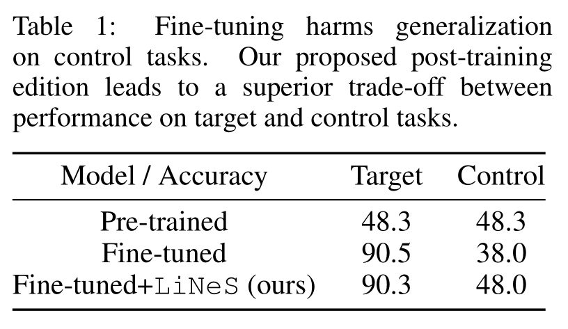
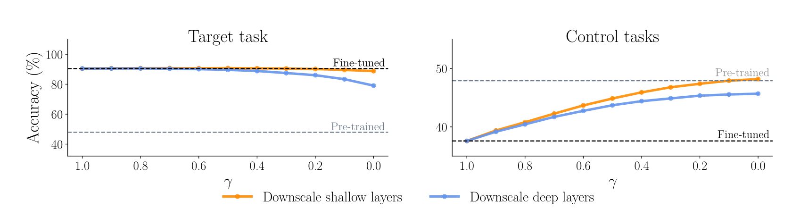
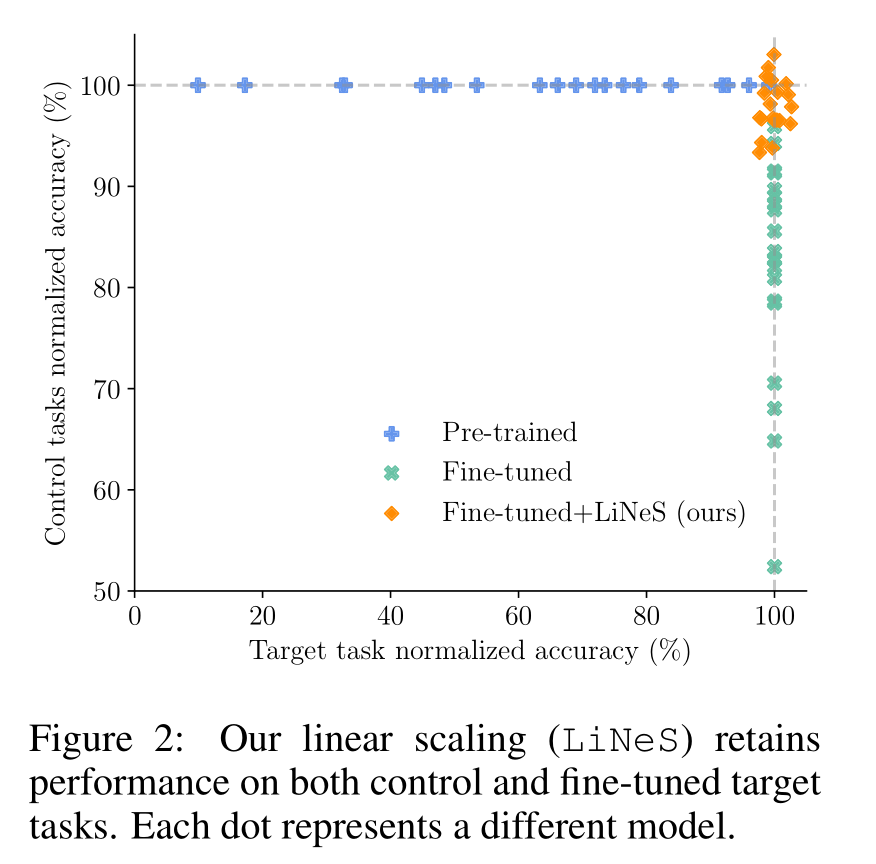
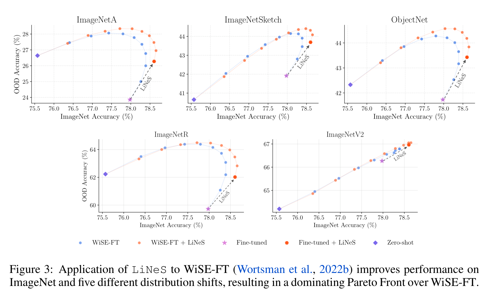
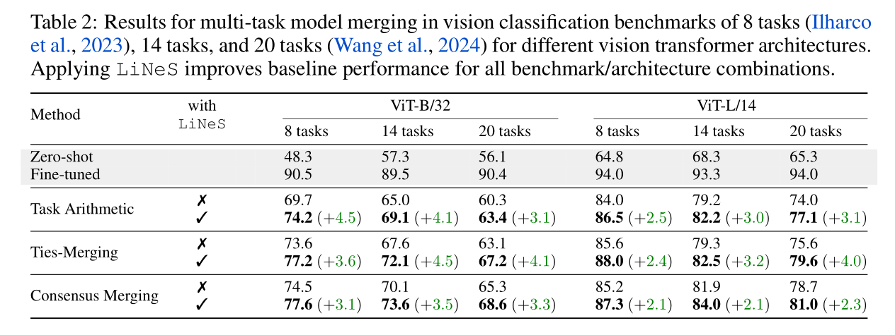
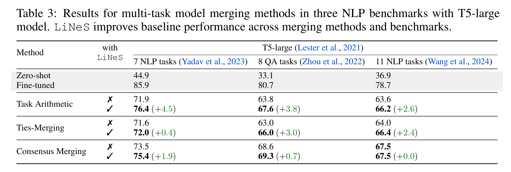
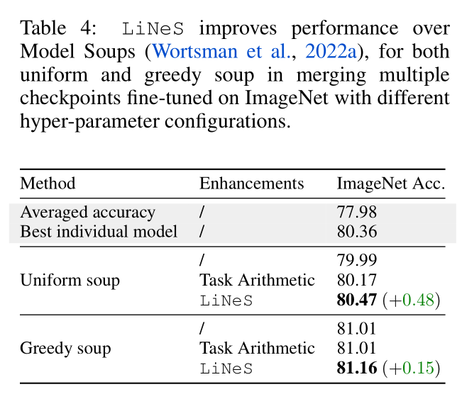
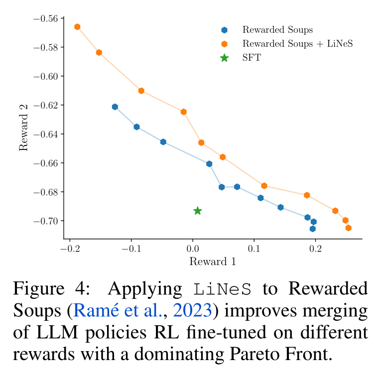
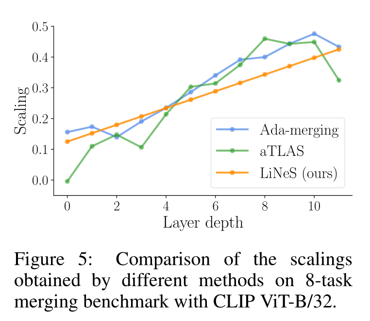

+++

title = "论文阅读：LiNeS Post-Training Layer Scaling Prevents Forgetting and Enhances Model Merging"

date = "2025-10-20"

[taxonomies]

tags = ["Model Merging", "Fine-Tuning"]

+++

‍

---

## Introduction

**Model Merging**: Combine avaliable checkpoints, <u>avoiding the costly process of joint trade-offs</u>, such as the forgetting of previously acquired knowledge. However, merging checkpoints fine-tuned on different tasks can lead to <u>significant performance degradation</u>.

**Catastrophic Forgetting Mitigation**: Many works propose:

- Regularizing the fine-tuning process
- Leveraging the insight that shallow layers capture generalizable representations, and applying lower learning rate to the shallow layers.

However, <u>modifying the fine-tuning process can be complex and computationally expensive</u>. Model editing and model merging methods that <u>directly edit the checkpoints in the weight space</u>.

**Drawbacks of Existing Methods**: Most model merging methods <u>overlook the insight that shallow layers should remain close to their pre-trained weights to avoid losing the general representations</u> they encode.

**Contribution of This Work**:

- We propose LiNeS, a post-training editing technique that <u>preserves the zero-shot generalization of pre-trained models</u> while <u>retaining fine-tuned knowledge</u> by applying layer-wise scaling on parameter updates.
- LiNeS significantly enhances multi-task model merging baselines.
- LiNeS can be applied to enhance existing weight interpolation methods.

> Wight Interpolation 是 Model Merge 的一种技术/方法。

---

## Related Work

**Representation Collapse and Regularized Fine-Tuning**:

- Pre-trained models <u>exhibit strong zero-shot performance</u> across diverse data distribution due to the <u>robust and transferable feature representations</u> learned during pre-training.

> Feature representation：深度学习模型一般不会直接处理原始数据，而是通过一系列计算将原始数据转换为利于理解的内部表示（Feature Representation）。

- However, fine-tuning on specific tasks often <u>harms the zero-shot generalization performance</u> on distributions different from the fine-tuning domain. This degradation arises from the <u>distortion of pre-trained feature during fine-tuning</u>. A phenomenon referred to as <u>*representation collapse*</u>.
- Modifying the fine-tuning process is far more computationally expensive compared to post-training merging methods.

**Weight Interpolation and Model Merging**: 

- It is shown that two solutions derived from <u>separate training runs can be connected by nonlinear paths of low loss</u>. Linear mode connectivity extended the paths to the linear case.

> 原本我们以为从通过不同的起点（随机初始化）出发，最终到达的两个模型（解）是相互隔离的。但是事实上存在一条 loss 很小的路径连接这两个解。

- These insights enabled the transfer of the benefits regarding <u>robustness output ensembles to weight ensembles</u>.

> Output Ensembles：把同个问题分别询问多个模型，综合它们的答案来得到最终结果
>
> Weight Ensembles：不再需要保留多个模型，而是直接合并成一个模型

- These findings can be leveraged to improve performance on <u>single-task, out-of-distribution</u>, multi-task and multi-objective alignment settings.

> 单个任务上训练多个模型合并起来能得到更好的模型，多个任务合并起来能获得多任务的模型。

- Several methods have tried to merge by preserving the important parameters defined via the Fisher Information Matrix, heuristics...

> 如何合并呢：简单加权肯定不行，因为有时候会直接抵消一些特征。因此有很多改进方法，例如 Fisher Information Matrix、Heuristics 启发式算法等

- Recent works use gradient descent to learn the <u>layer-specific merging coefficients</u> per task, e.g., Ada-merging.

> 学习如何合并，每一层、每个任务都学习一个独特的合并系数

---

## Post-Training Layer-Wise Scaling Mitigates Forgetting

We present the key insight of this work: Scaling down the updates of shallow layer after fine-tuning can <u>mitigate catastrophic forgetting</u>, <u>restore zero-shot generalization</u>, <u>preserving performance on the target task</u>.

**Notation**: We consider a pre-trained model $\theta_0 \in \mathbb{R}^N$. Fine-tuning on a specific task $t$ results in the fine-tuned weights $\theta_t$. The <u>task vector</u> or residual for task $t$ is defined as

$$
\tau_t:= \theta_t - \theta_0.
$$

**Fine-Tuning Leads to Catastrophic Forgetting**: Consider an $8$-task image classification problem. We fine-tune a CLIP ViT-B/32 model on each task, measuring performance on the fine-tuned task (target task) and the remaining $7$ tasks (control tasks).

​

**Shallow-Layer Updates Impact Minimally on Target Task Accuracy**:

- Most parameter updates during fine-tuning are <u>redundant</u>, as similar performance is <u>achievable without updating most pre-trained weights</u>.
- Prior work shows that <u>task-specific features are often concentrated in deeper layers of the network</u>.
- We apply a scaling factor to the updates to the $\ell$-th layer $\tau^{(\ell)}$,

$$
\lambda^{(\ell)}=\gamma+(1-\gamma)\frac{\ell-1}{L-1}, \quad \forall\ell\in[L],\gamma\in[0,1]
$$

- We observe that even with strong downscaling of shallow layers, the target task accuracy remains nearly unaffected. In contrast, when we downscale the deeper layers, target task accuracy drops significantly.

​

> 首先进行 Fine-Tune 获得各个层的更新量，然后用 $\lambda^{(\ell)}$ 对各层的更新量进行放缩，$\gamma$ 越小说明浅层更新量被缩小得越厉害。左图中可以看出浅层更新量的改变几乎不影响 Target Task。

**Shallow-Layer Updates Undermine Zero-Shot Generalization**: We further hypothesize that the <u>degradation of performance on control tasks is largely due to distortions in the shallow layers</u>. We can see that as the strength of the shallow-layer downscaling increases, the accuracy on control tasks approaches the original pre-trained model's performance.

**Improved Trade-Off between Target and Control Performance**: We apply the method to a 20-task computer vision benchmark. Figure 2 shows that <u>fine-tuning degrades zero-shot generalization</u>, and our method improves generalization while maintaining near-full target task accuracy.

​

> 上图中的每个点分别对应 20 个任务。

---

## Method

**Layer-increasing Network Scaling**: Given a task vector $\tau$ with $L$ layer blocks, we apply layer-wise linear scaling to adjust the contributions of shallow and deep layers using:

$$
\tau_{\mathrm{LiNeS}}=\mathrm{concat}\left(\lambda^{(1)}\tau^{(1)},\ldots,\lambda^{(L)}\tau^{(L)}\right),\quad\mathrm{where} \quad \lambda^{(\ell)}=\alpha+\beta\frac{\ell-1}{L-1},\quad\forall\ell\in[L].
$$

**Application in Model Merging**: Notice that $\tau$ can correspond to either a single-task residual or, in the context of model merging, a multi-task vector obtained by merging the residuals of multiple checkpoints fine-tuned starting from a common initialization.

---

## Experiments

**Improving Robust Fine-Tuning for OOD Generalization**:

- WiSE-FT: Linearly interpolate between the pre-trained and the fine-tuned weights: $\tau: (1 - \gamma) \theta_0 + \gamma \theta = \theta_0 + \gamma \tau$ for $\gamma \in [0, 1]$.
- We evaluate CLIP models fine-tuned on ImageNet, considering $5$ OOD datasets.

​

**Improving Multi-Task Model Merging**:

- Task Arithmetic: Generate a multi-task vector $\tau_{\text{MTL}} = g(\tau_1, \cdots, \tau_T)$ with merging function $g$, and construct $\theta = \theta_0 + \lambda \cdot \tau_{\text{MTL}}$. In this work, "task arithmetic" is implemented by <u>averaging the task vectors</u>.

> Task vector 指的是在某个 task 微调后，参数的变化量。

- Performance Loss during Merging: This performance decrease partially stems from interference among task vectors.

- We can edit each task vector with `LiNeS`​ before merging to restore the generalization to other tasks, or simply <u>edit the merged multi-task vector to preserve the shallow and general features</u>.

- We tune $\beta$ and set $\alpha$ to

$$
\alpha=\frac{1}{N_{\mathrm{models}}}\frac{\|\tau_{\mathrm{sum}}\|}{\|\tau_{\mathrm{MTL}}\|},\quad \mathrm{where} \quad \tau_{\mathrm{sum}}=\sum_{i=1}^{N_{\mathrm{models}}}\tau_{i}
$$

**Computer Vision**:

​

**Natural Language Processing**:

​

**Model Soups for Merging Single-Task Models**: Averaging in weight space <u>multiple models fine-tuned on the same task derived from the same pre-trained model</u> has been shown to increase target performance. We investigate whether `LiNeS`​ can enhance the test performance when merging single-task models.

$$
\theta_{\mathrm{soup}}=\theta_0+\tau_{\mathrm{soup}}, \quad \mathrm{where} \quad \tau_{\mathrm{soup}}=\frac{1}{N_{\mathrm{models}}}\sum_{i=1}^{N_{\mathrm{models}}}\left(\boldsymbol{\theta}_i-\boldsymbol{\theta}_0\right)
$$

​

> Uniform Soup 指把所有模型平等看待，Greedy Soup 表示保留一个验证集对模型进行筛选

**Improving Rewarded Soups**:

- Starting with an LLM parameterized by weights $\theta_0$, we first fine-tune it using SFT resulting in weights $\theta_{\text{SFT}}$.
- We then apply RLHF, training two independent policies via PPO to maximize the rewards $R_1$ and $R_2$.
- We linearly interpolate the residuals $\tau_1 = \theta_1 - \theta_{\text{SFT}}$ and $\tau_2 = \theta_2 - \theta_{\text{SFT}}$​

$$
\theta_{RS}=\theta_{\mathrm{SFT}}+\lambda\tau_{1}+(1-\lambda)\tau_{2},\quad\lambda\in[0,1],
$$

​

---

## Discussion

We compare `LiNeS`​ with prior work that optimizes the scaling coefficients via backpropagation:

- Ada-Merging: Minimizes the entropy loss of the predictions on the test set
- aTLAS: Minimizes a cross entropy loss on validation samples

Both methods operate on a more fine-grained level and introduce coefficients per layer and per task. Ada-merging and aTLAS requires excessive memory overhead and multiple training epochs.

​

---

## Questions and Comments

- 模型合并和缓解遗忘很像：无非就是解决任务/数据的冲突
- Layer-Wise：线性的 scaling 一定是最优的吗？能不能有更好的方式？
- Task-Wise：不同任务之间能不能更好的合并方式？
- Catastrophic Forgetting：Representation Learning 中有没有其他相关的结论，能直接拿来用？

‍
