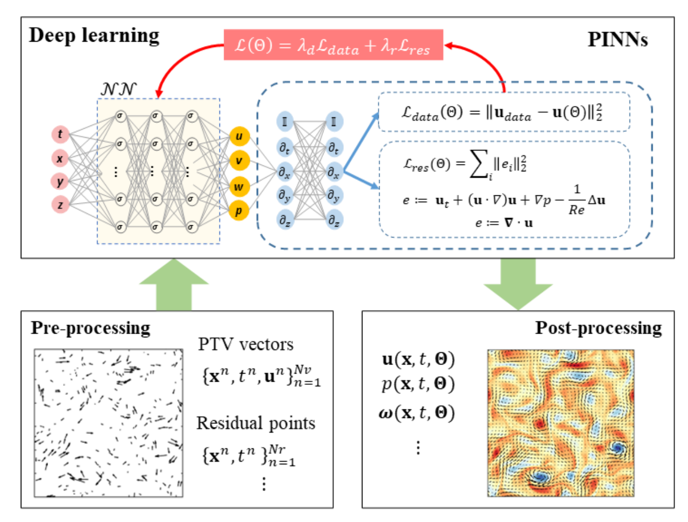
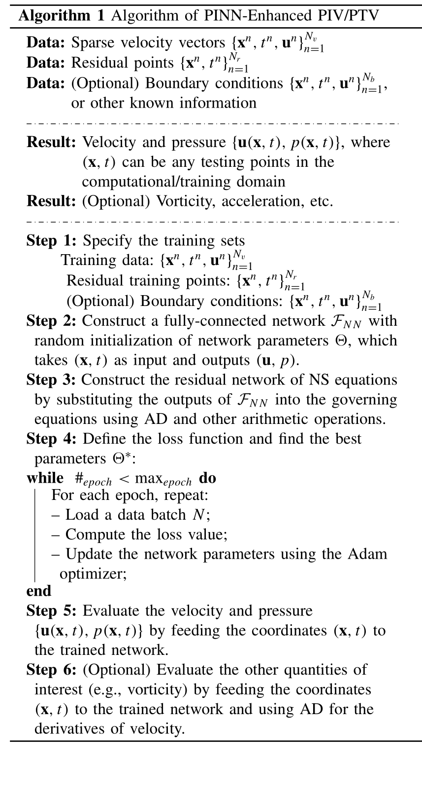

+++

title = "论文阅读：PINNs for PTV"

date = "2025-10-01"

[taxonomies]

tags = ["PINNs", "Scientific Computing"]

+++

> Original Paper: [Physics-Informed Neural Networks Enhanced Particle Tracking Velocimetry: An Example for Turbulent Jet Flow | IEEE Journals &amp; Magazine | IEEE Xplore](https://ieeexplore.ieee.org/document/10522764)

---

## Introduction

**Particle Image Velocimetry**: An optical measurement technique that determines an instantaneous velocity field by statistically analyzing the displacement of dense concentrations of tracer particles within interrogation regions over a short time interval.

> PIV 追踪一块区域（interrogation window）的整体移动

**Particle Tracking Velocimetry**: An optical measurement technique that determines the pathways and velocities of individual tracer particles by identifying and tracking each particle over a sequence of images.

> PTV 追踪单个粒子的精确轨迹

**Limitation of PIV**: PIV is generally limited by the size of the interrogation window and the number density of the recorded particles.

**Limitation of PTV**: The sparsity of the seeding particles also limits the spatial resolution achievable by PTV.

---

## PINNs

**Velocities**: Assuming the velocities obtained from PIV/PTV are denoted as

$$
\mathcal{D}:\{\mathbf{x}^n,t^n,\mathbf{u}^n\}_{n=1}^{N_v},
$$

where $\mathbf{x}$ and $t$ are the space and time coordinates, $\mathbf{u}$ is the velocity, $N_v$ denotes the total number of vectors in the spatiotemporal domain $\Omega \times T$.

**PINNs**: A neural network $\mathcal{NN}$ is used to approximate the solution of the flow field

$$
(\mathbf{u},p)=\mathcal{NN}(\mathbf{x},t,\Theta).
$$

where $\mathcal{NN}$ receives the coordinates as input and $\Theta$ is the learnable parameters in the network. $\mathbf{u}(\mathbf{x}, t, \Theta)$ and $p(\mathbf{x}, t, \Theta)$ are the velocity and pressure fields. In general, $\mathcal{NN}$ is instantiated by using a feed-forward fully connected network.

​

**Data Loss**: We apply the velocity data $\mathcal{D}$ as labels and minimize the mean squared loss:

$$
\mathcal{L}_{\mathrm{data}}(\Theta)=\sum_{(u,v,w)}\sum_{n=1}^{N}\parallel\mathbf{u}_{\mathrm{data}}^{n}-\mathbf{u}(\mathbf{x}^{n},t^{n},\Theta)\parallel_{2}^{2}.
$$

This penalizes the mismatch between the data $\mathbf{u}_{\text{data}}^n$ and the network output $\mathbf{u}(\mathbf{x}^n, t^n, \Theta)$, where $\sum_{(u,v,w)}$ dentoes the summation over three velocity components, $\sum_{n=1}^{N}$ is the summation over different data points, and $N$ is the batch size for one training iteration.

**Residual Loss**: Another loss function penalizing the residuals of the governing equations is introduced:

$$
\mathcal{L}_{\mathrm{res}}(\Theta)=\sum_{i}\sum_{n=1}^{N}\parallel\mathbf{e}_{i}(\mathbf{x}^{n},t^{n},\Theta)\parallel_{2}^{2}
$$

where $\mathbf{e}$ includes the residuals of the governing equations for flow motion. For instance, $\mathbf{e}_i$ can be 

$$
\begin{aligned}
 & e_{1}=u_t+(uu_x+vu_y+wu_z)+p_x-1/\mathrm{Re}(u_{xx}+u_{yy}+u_{zz}) \\
 & e_{2}=v_t+(uv_x+vv_y+wv_z)+p_y-1/\mathrm{Re}(v_{xx}+v_{yy}+v_{zz}) \\
 & e_{3}=w_t+(uw_x+vw_y+ww_z)+p_z-1/\mathrm{Re}(w_{xx}+w_{yy}+w_{zz}) \\
 & e_{4}=u_x+v_y+w_z
\end{aligned}
$$

**Boundary Condition**: If the boundary conditions of the investigated flow are known, we have

$$
\mathcal{L}_{\mathrm{bcs}}(\Theta)=\sum_{(u,v,w)}\sum_{n=1}^{N}\|\mathbf{u}_{\mathrm{bcs}}^{n}-\mathbf{u}(\mathbf{x}^{n},t^{n},\Theta)\|_{2}^{2},
$$

where $\{\mathbf{x}^n,t^n,\mathbf{u}_{\mathrm{bcs}}^n\}_{n=1}^{N_b}$ denote the Dirichlet boundary conditions on $\mathbf{x} \in \partial \Omega$.

**Overall Loss Function**: The loss function of PINN can be defined as

$$
\mathcal{L}(\Theta)=\lambda_d\mathcal{L}_{\mathrm{data}}+\lambda_r\mathcal{L}_{\mathrm{res}}+\lambda_b\mathcal{L}_{\mathrm{bcs}}
$$

where $\lambda_\ast$ are the weighting coefficients used to balance different terms in the loss function.

​

---

## Generic Workflow in Real Experiments

**Preprocessing**: This step is to prepare the training sets in a proper format as required for PINN training. The velocity vectors loaded from PIV/PTV experiments are generally dimensionalized, so a nondimensionalization step is required:

$$
\mathbf{x}^*=\frac{\mathbf{x}}{L},\quad\mathbf{u}^*=\frac{\mathbf{u}}{U},\quad t^*=\frac{t}{L/U},\quad p^*=\frac{p}{\rho U^2},
$$

where $L$ is the length scale and $U$ is the velocity scale. Then $\{\mathbf{x}^{*n},t^{*n},\mathbf{u}^{*n}\}_{n=1}^{N_v}$ will be used in the data loss. Given the kinematic viscosity of the fluid $\nu$, the Reynolds number is defined as

$$
\mathrm{Re}=\frac{\mathrm{UL}}{\nu}.
$$

If the boundary conditions are known, we can extract the boundary points $\{\mathbf{x}^{*n},t^{*n}\}_{n=1}^{N_{b}}$ and the corresponding velocity $\{\mathbf{u}_{\mathrm{bcs}}^{*n}\}_{n=1}^{N_{b}}$. Eventually, the training data are composed of

$$
\{\mathbf{x}^{*n},t^{*n},\mathbf{u}^{*n}\}_{n=1}^{N_{v}},
\quad
\{\mathbf{x}^{*n},t^{*n}\}_{n=1}^{N_{r}},
\quad
\{\mathbf{x}^{*n},t^{*n},\mathbf{u}_{\mathrm{bcs}}^{*n}\}_{n=1}^{N_{b}}.
$$

**Postprecessing**: We generate an Euler mesh by defining the dimensionless time interval $\mathrm{d}t$ and spacing step $\mathrm{d} \mathbf{x}$. The evaluation points are defined as $(\mathbf{x}_{\mathrm{grid}}^*,t_{\mathrm{grid}}^*)$. Note that the flow fields should be dimensionalized back to the original units:

$$
\begin{aligned}
(\mathbf{u}^{*},p^{*}) & =\mathcal{NN}\left(\mathbf{x}_{\mathrm{grid}}^{*},t_{\mathrm{grid}}^{*}\right) \\
\mathbf{u} & =\mathbf{u}^{*}\times U \\
p & =p^{*}\times\rho U^{2}
\end{aligned}
$$

where $(\mathbf{u}^{*},p^{*})$ are the dimensionless output of the last layer in the neural network and $(\mathbf{u},p)$ are the dimensional quantities which are used for visualization.

‍
