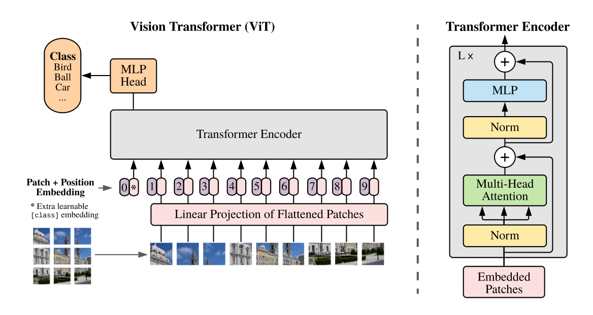
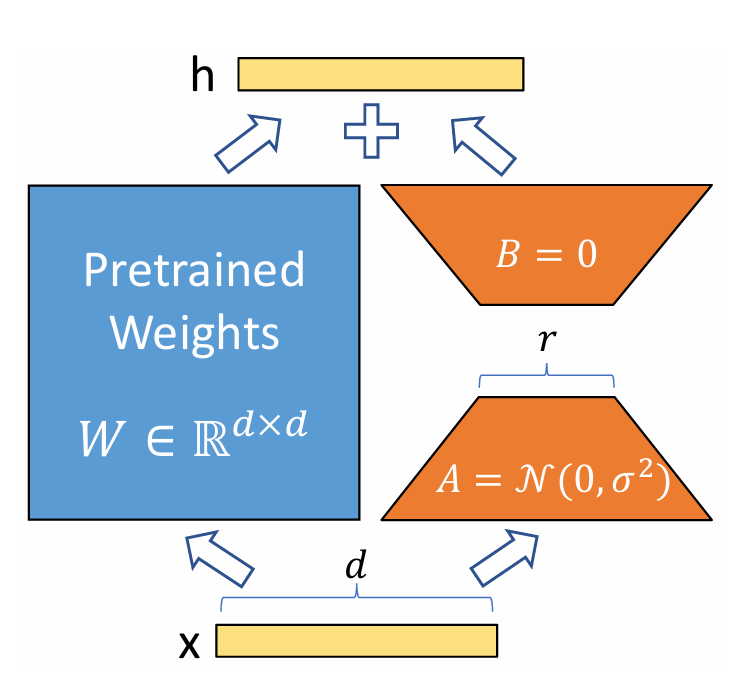
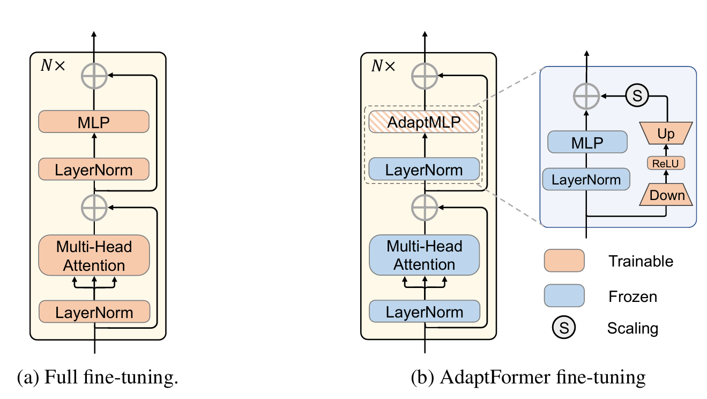
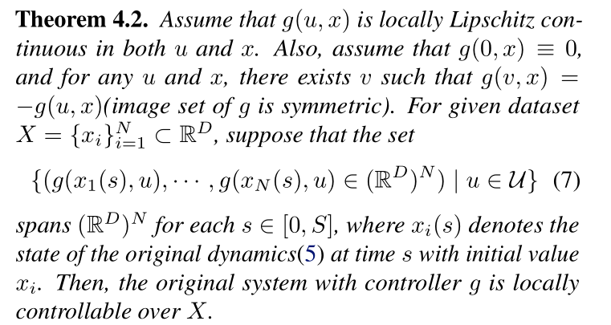
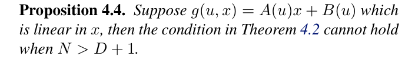
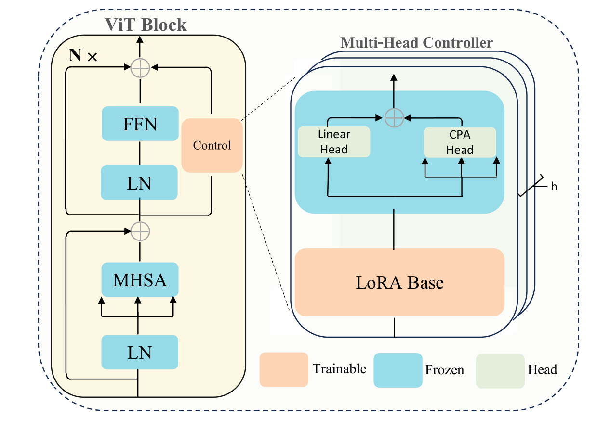
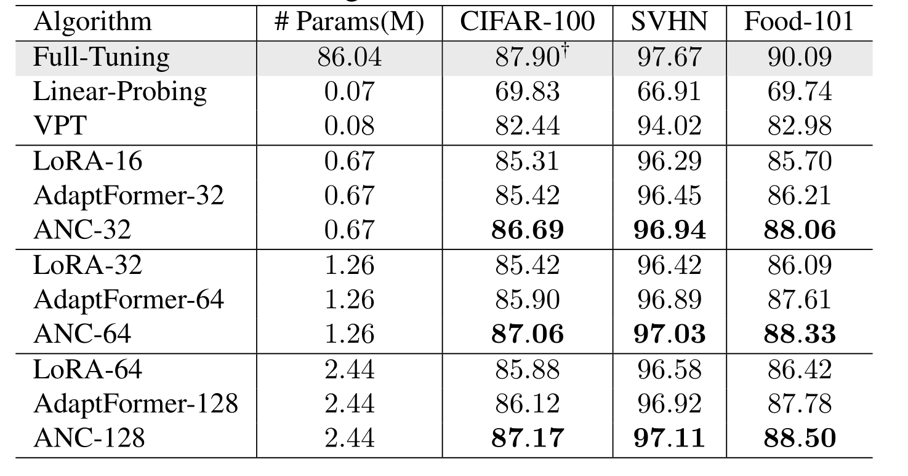
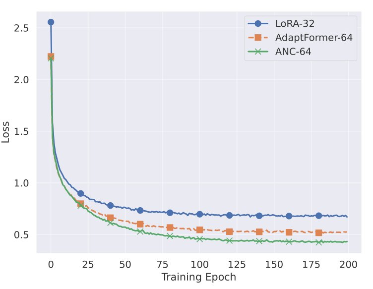
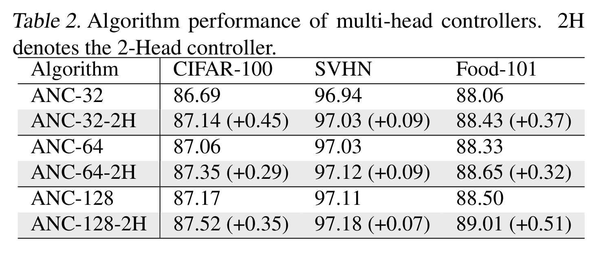

+++

title = "论文阅读：Parameter-Efficient Fine-Tuning with Controls"

date = "2025-09-15"

[taxonomies]

tags = ["Optimal Control", "Machine Learning", "Computer Vision"]

+++

> [Original Paper](https://raw.githubusercontent.com/mlresearch/v235/main/assets/zhang24y/zhang24y.pdf)​

---

## Introduction

**ViT**:

​

**LoRA**: LoRA (Low-Rank Adaptation) freezes the original model weights and injects trainable, low-rank matrices into its layers.

​

**AdaptFormer**: AdaptFormer adapts Vision Transformers to new tasks by inserting small, lightweight modules in parallel to the existing feed-forward networks.

​

---

## A Control Formulation of PEFT Algorithms

**Notation**: Given an image $x_0 \in \mathbb{R}^{C \times H \times W}$(Channel, Height, Width), the ViT model splits and embeds it into visual tokens $x_0^\prime \in \mathbb{R}^{m \times d}$, where $m$ denotes the number of tokens and $d$ refers to the length of each token. By adding an additional class-token, ViT forms $x_1 \in \mathbb{R}^{(m+1) \times d}$. The $t$-th block of ViT is defined as:

$$
x_{t+\frac12}=\text{MHSA}(\text{LN}(x_t))+x_t, \quad x_{t+1}=\text{FFN}(\text{LN}(x_{t+\frac12}))+x_{t+\frac12}
$$

for $t = 1,2, \cdots, T-1$. Here MHSA, FFN and LN denote the multi-head self-attention, feed-forward network and layer normalization, respectively.

**Dynamics of LoRA**: LoRA finds functions $\{g_t\}$ to

$$
x_{t+1}=f_{t}\left(x_{t},\theta_{t},g_{t}(x_{t},u_{t})\right).
$$

where $x_t \in \mathbb{R}^{(m+1) \times d}$ is the token at the $t$-th layer, $\theta_t$ is the parameter at the $t$-th layer, and $g_t(x_t, u_t) = x_tu_t$ satisfies

$$
u_t=A_tB_t,\quad A_t\in\mathbb{R}^{d\times r},B_t\in\mathbb{R}^{r\times d}, \quad r\ll d.
$$

**Dynamics of AdaptFormer**: The dynamics can be expressed as

$$
x_{t+1}=f_t(x_t,\theta_t)+g_t(x_t,u_t).
$$

**Overall Goal**: The objective is to find the control such that the terminal loss on downstream tasks could be minimized:

$$
\min_{\{u_t,\theta_T\}}\frac1N\sum_{i=1}^N\mathcal{L}(x_{\mathrm{Pred},i},y_i)
$$

such that

$$
x_{t+1,i}={f}_t(x_{t,i},\theta_t)+g_t(x_{t,i},u_t), \quad t\in[1,\cdots,T-1],
$$

$$
x_{\mathrm{Pred},i}=f_T(x_{T,i}^\mathrm{cls},\theta_T).
$$

Here $N$ indicates the number of samples.

---

## Controllability Analysis

**A Sufficient Condition for Controllability**:

​

**Benefits of Nonlinear Controller**: Let $N$ denote the number of samples and $D$ denotes the dimension of state/parameter.

​

‍

---

## Nonlinear Controller Design

**CPA (Cross-Patch Attention)** : Add additional cross-patch mechanism

$$
x^{p(j')}=\text{CPA}(x)=\sum_j\frac{\exp\langle x^{p(i)},x^{p(j)}\rangle}{\sum_m\exp\langle x^{p(i)},x^{p(m)}\rangle}x^{p(j)}
$$

where $x^{p(j)}$ denotes the $j$-th patch of $x$.

**Nonlinear Controller Design**:

‍

​

$$
\operatorname{Control}(x)=\operatorname{LoRA}(x)+\operatorname{CPA}\left(\operatorname{LoRA}(x)\right)
$$

---

## Experiments

**Competing Algorithms**: We compare our method with the following algorithms:

- Full-Tuning
- Linear Probing: Appending an additional trainable linear layer on top of the pre-trained model while keeping the rest parameters fixed.
- Visual Prompt Tuning (VPT): Concatenating a set of trainable tokens with existing image tokens.
- LoRA: Injecting trainable low-rank matrices to $W_Q$ and $W_V$.
- AdaptFormer: A vision-specific LoRA algorithm by perturbing the FFN layer with (almost) linear controls.

**Experiments on Vision Benchmarks**: 

​

​

**Multi-Head Controller Experiment**: 

​

‍
