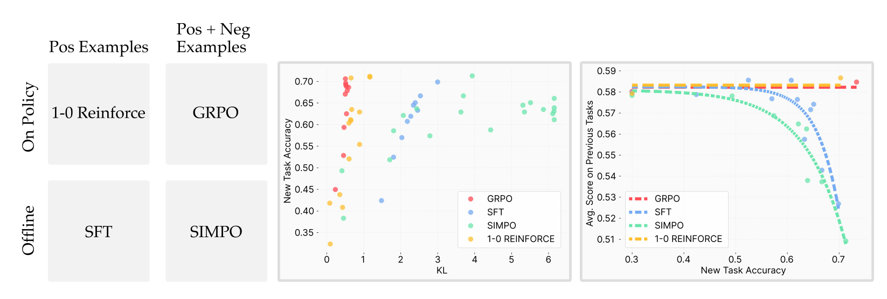
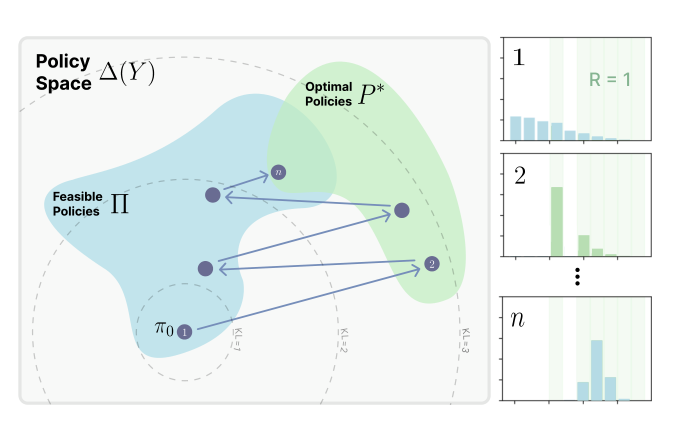
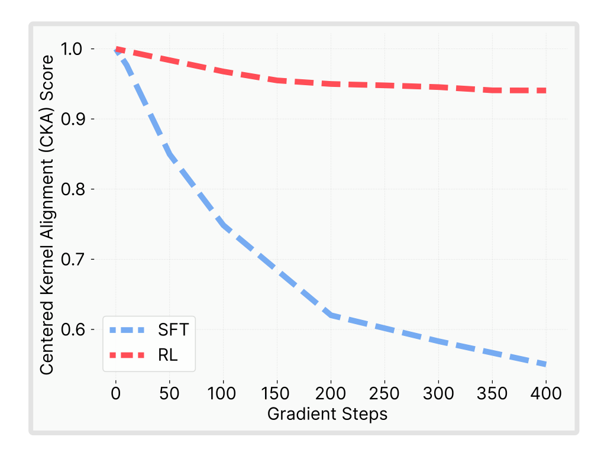
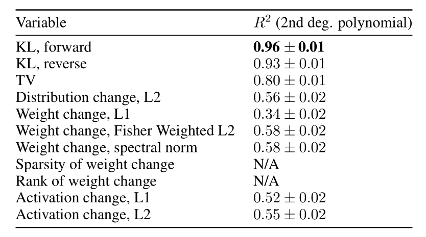
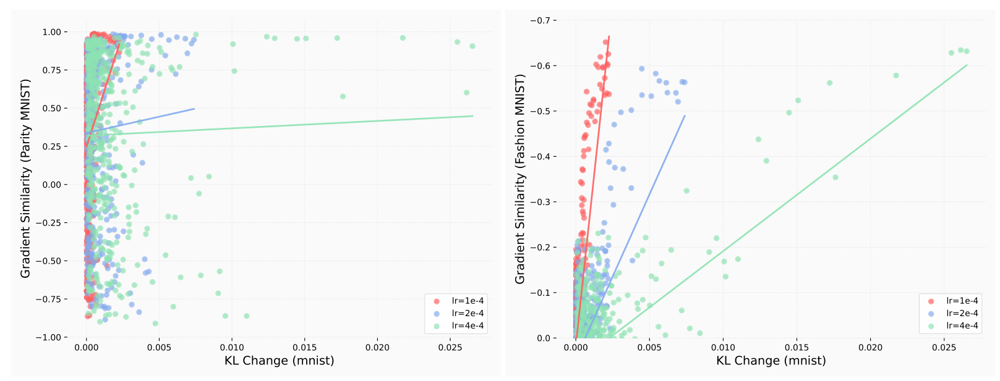

+++

title = "论文阅读：RL's Razor Why Online Reinforcement Learning Forgets Less"

date = "2025-09-10"

[taxonomies]

tags = ["Machine Learning", "Continual Learning", "Fine Tuning"]

+++

> Original Paper: [[2509.04259] RL&apos;s Razor: Why Online Reinforcement Learning Forgets Less](https://www.arxiv.org/abs/2509.04259)
>
> Posts: [RL&apos;s Razor: Why On-Policy Reinforcement Learning Forgets Less](https://jyopari.github.io/posts/rl_razor)

---

## Introduction

**On-Policy RL**: The agent learns only from experience <u>generated by its currect policy</u>. It follows its current strategy, collects data, updates its strategy, and then discards the old data.

**Off-Policy RL**: The agent can learn from experience <u>generated by a different policy</u>. This could be data from an older version of itself, from a human demonstrator, or from another AI.

> On-Policy RL 只学习由【当前最新版本】的策略所产生的经验，Off-Policy 允许学习由【任何策略】（包括过去的自己、人类专家等）所产生的经验。

**Online RL**: The agent learns by <u>actively interacting with a live environment</u>. It takes an action, gets a result, and learns from it in real-time.

**Offline RL**: The agent learns from a <u>fixed, pre-collected dataset of past interactions</u>. It has no ability to explore or gather new data.

> Online 和 On-Policy 的辨析
>
> - Online 决定了经验是如何产生的：是通过与环境的实时互动，而非提前准备好
> - On-Policy 决定了采集到的经验是如何被使用的，是“用完即弃”（On-Policy），还是“存起来反复用”（Off-Policy）
>
> Offline 和 Off-Policy 的辨析：Offiline 一定是 Off-Policy 的，反之不一定

**Previous Approaches to Catastrophic Forgetting**: Previous approaches such as <u>constraining weight updates</u>, <u>preserving learned features</u>, or <u>regularizing shift in output distribution</u> focus on its effects rather than its underlying cause. Some prior work claimed that forgetting can be determined by <u>how much the model's distribution shifts on past tasks</u>, but in practice this is infeasible because the set of prior tasks is vast or even unbounded.

**EWC**: Elastic weight consolidation can be seen as approximations to KL minimization.

**SFT Versus RL**: Prior comparisons between SFT and RL have focused on new task performance rather than the extent of forgetting. It is found that on-policy learning can <u>achieve stronger performance when the expert providing supervision is the same</u>.

**ParityMNIST**: ParityMNIST is derived from MNIST, but reframes the task as predicting parity (even vs. odd).

---

## Contribution of This Work

**RL Forgets Less than SFT**: Even when SFT and RL achieve the same performance on the new task, we observe that SFT often achieves new-task gains by erasing prior knowledge, while RL better preserves old skills.

 Left: RL converges to those closest in KL to the base model. (2) Right: RL preserves better prior-task performance compared to SFT.")​

**Empirical Forgetting Law**: When fine-tuning a model $\pi$ on a new task $\tau$, the degree of forgetting is accurately predicted by $\mathbb{E}_{x \sim \tau}[\operatorname{KL}(\pi_0 ||\pi)]$, where $\pi_0$ is the base policy. **KL divergence is a reliable predictor of forgetting across settings**.

**Difference between SFT and RL**: On-policy methods such as RL are inherently <u>biased toward solutions that remain closer to the original policy in KL divergence</u>.

**KL Hypothesis Validation**: We construct a "oracle SFT" that minimizes KL divergence while achieving perfect accuracy, which achieves even less forget than RL. This demonstrate that <u>RL's advantage does not stem from being inherently different, but from its implicit KL minimization</u>.

> 并不是 RL 好，而是 RL 中内含的 KL Minimizer 减少了遗忘，如果 SFT 能降低 KL Divergence，其也能减少遗忘。

---

## Results

**Experimental Setup**: We fine-tuned models using the same set of prompts. One group of models was trained with SFT, and another with RL using GRPO. In RL training, we used only a binary success indicator as the reward, **without explicit KL regularization**.

- LLM, Math Reasoning: Qwen 2.5 3B-Instruct on Open-Reasoner-Zero dataset.
- LLM, Science Q&A: Qwen 2.5 3B-Instruct on Chemistry L-3 subset of SciKnowEval.
- LLM, Tool use: Qwen 2.5 3B-Instruct on ToolAlpaca dataset.
- Robotics, Pick and Place: OpenVLA 7B on SimplerEnv environment.

**RL Forgets Less than SFT**: RL is able to learn new tasks while incurring minimal forgetting, whereas SFT reaches similar new-task performance only by sacrificing prior knowledge.

 and prior task (y-axis). Each point corresponds to a model trained with a different set of hyperparameters.")​

**Smaller KL Divergences Lead to Less Forgetting**: We pretrained a MLP jointly on a subset of ParityMNIST and FashionMNIST, then fine-tuned only on ParityMNIST while measuring forgetting on FashionMNIST. We constructed an oracle SFT distribution (use the KL minimization answer as label instead of the true label).

 SFT outperforms RL only when an oracle distribution is used. (2) Forgetting aligns a single curve when plotted against KL divergence. (3) RL improves new-task accuracy with much smaller KL shifts than SFT.")​

- ​`SFT on dist 1`​: All even digits mapped to label 0, all odd digits to label 1.
- ​`SFT on dist 2`​: Even digits randomly mapped to $\{0, 4\}$, odd digits to $\{1,5\}$.
- ​`SFT on optimal dist`​: Annotations drawn from the minimum-KL distribution consistent with task correctness. Concretely, for an input image $x$ we compute $\pi_0(\cdot | x) \in \mathbb{R}^{10}$ and the binary indicator vector $R \in \{0,1\}^{10}$ encoding which labels are correct given the digit's parity. The oracle distribution $q^\ast$ is the solution to

$$
q^*=\arg\min_qD_{\text{KL}}(\pi_0\|q)\quad\text{s.t.}\quad q^\top R=1.
$$

> 例如给定图片 $2$，因为其是偶数，$R$ 在所有偶数位置为 $1$​，那么上面的向量 `R = [1, 0, 1, 0, 1, 0, 1, 0, 1, 0]`​

**On-Policy Methods Lead to Smaller KL Divergence**: Here we consider the loss function of SFT and RL:

- SFT minimizes cross-entropy against a supervision distribution $\pi_\beta$ over a distribution of inputs $\mathcal{D}$​

$$
{\mathcal{L}}_{\mathrm{SFT}}(\pi)=-\mathbb{E}_{x\sim\mathcal{D},y\sim\pi_{\beta}}[\log\pi(y|x)]
$$

- Let $A(x,y)$ be an advantage function. RL with policy gradient optimizes

$$
\mathcal{L}_{\mathrm{RL}}(\pi)=-\mathbb{E}_{x\sim\mathcal{D},y\sim\pi}\left[A(x,y)\log\pi(y|x)\right]
$$

. There are two features that distinguish RL from SFT:

- Sampling Distribution: While in RL the training was done on outputs <u>drawn from the model’s own distribution</u>, in SFT they <u>come from fixed external annotations</u>.
- Negative Examples: While sampling from $\pi$, some of the responses will be incorrect. These are usually assigned a <u>negative coefficient</u> $A(x,y)$. This pushes probability mass away from poor outputs.

Our hypothesis is that one of these two differences is what causes RL's resistance to forgetting. So we perform experiments with four different objectives: "GRPO", "1-0 Reinforce", "SFT", and "SimPO". The results show that <u>the critical factor is the use of on-policy data</u>.

​

**Theoretical Perspective**: Sampling from the model’s own distribution keeps it close to the base model, while SFT pushes it toward arbitrary external distributions.

​

> RL 的 policy 更新可以被视作来回的投影，源于 Information Geometry 的领域。假设空间中有我们的策略 $\pi_k$，可行空间 $\Pi$，最优空间 $P^\ast$。
>
> - SFT 就像给定一个 $P^\ast$ 的一个坐标，让我们传送到那里，不管距离有多远
> - RL 则先用 Information Projection 选择 $P^\ast$ 中最近的位置进行投影，再用 Momentum Projection 投影到 $\Pi$ 中。最终 RL 可以视作一次在 $\Pi$ 中的更新。

---

## Alternative Hypothesis

We systematically evaluated alternative variables as potential predictors of catastrophic forgetting, grouped into four categories.

**Weight-Level Changes**: Many prior work tried to mitigate forgetting by <u>constraining the change in parameter space</u>. We measured parameter changes under L1, Fisher-weighted L2, and spectral norm metrics. These metrics correlated only weakly with forgetting: <u>large parameter shifts could occur without forgetting, and conversely, forgetting sometimes occurred despite small parameter movement</u>.

**Representation/Activation-Level Changes**: Some other papers focused on <u>maintaining the previous features</u>. We examined hidden activation shifts (L1 and L2 distances) as proxies for changes in internal representations. Although we found that there is representation drift during training, the <u>curves were distinct between training objectives</u> (不同训练方法的【Activation Change-Forgetting】曲线不同), meaning that it is not a good predictor.

​

> CKA (Centered Kernel Alignment) 是一种数学工具，用于衡量两个分布的相似度。CKA 越接近 $1$ 说明与原始分布越接近。上图说明了 SFT 中模型的内部知识结构（表征）遭到了破坏。

**Sparsity and Rank of Updates**: Some argue that RL updates are sparse while SFT weight updates are dense. We found that the reason for the observed sparse updates was the use of `bfloat16`​, which may ignoring some small updates. Performing the same training with `float32`​ leads to identical performance without any sparsity. So we found that <u>all algorithms lead to full rank weight updates</u>.

**Distributional Distances**: We considered multiple measures of output distribution change: (1) Forward KL $\mathbb{E}_{x \sim \tau}[\operatorname{KL}(\pi_0 || \pi)]$, (2) Reverse KL $\mathbb{E}_{x \sim \tau}[\operatorname{KL}(\pi || \pi_0)]$, (3) Total Variation, (4) $L_2$ distance between distributions.

​

> Distribution 在这里指最终模型输出的差别，因为衡量遗忘最直接的办法是衡量其对老问题的回答有没有变。这里 $R^2$ 是一种统计指标，$R^2 = 1$ 表示完美预测。

---

## Additional Results

**Gradient Similarity versus KL Change**:

​

‍
