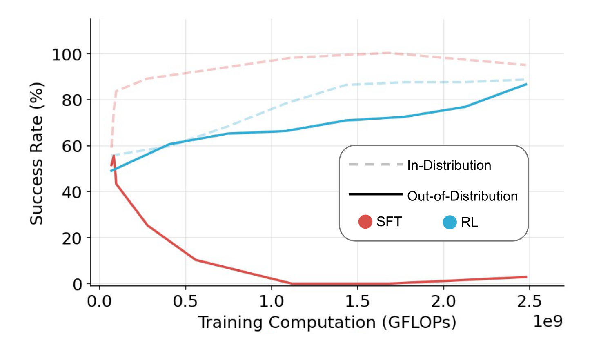
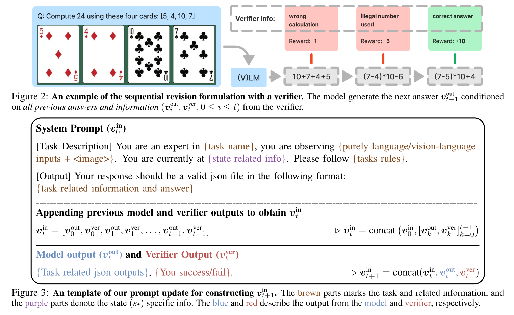
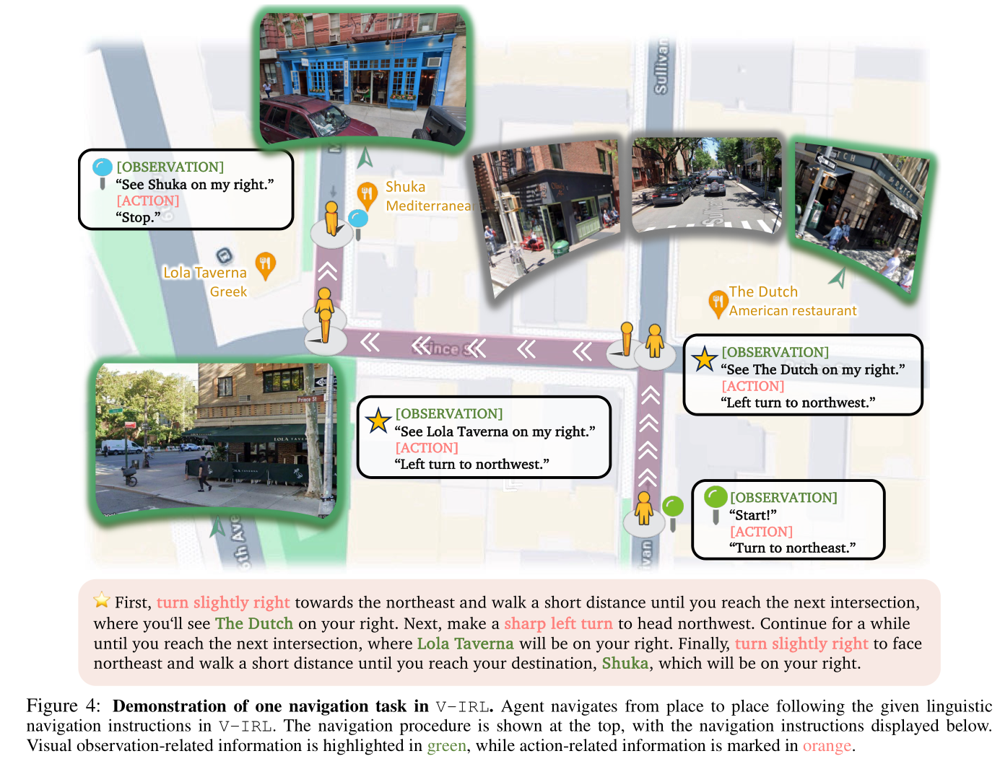
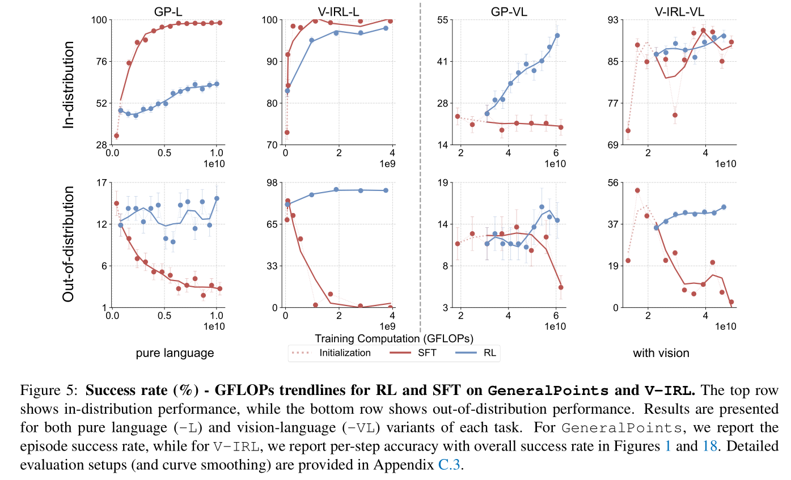
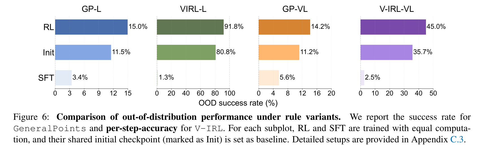
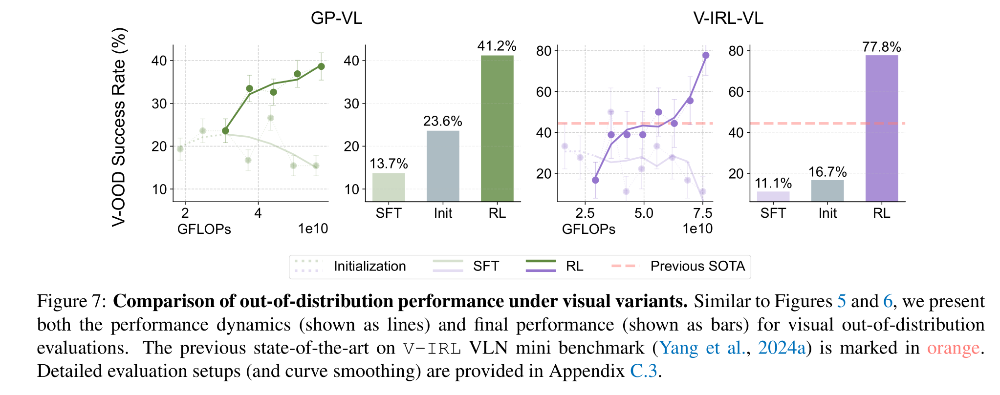
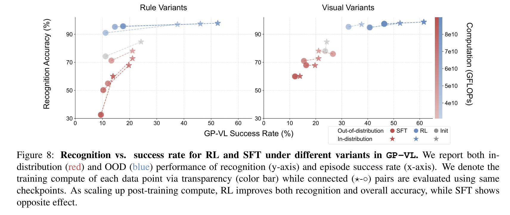
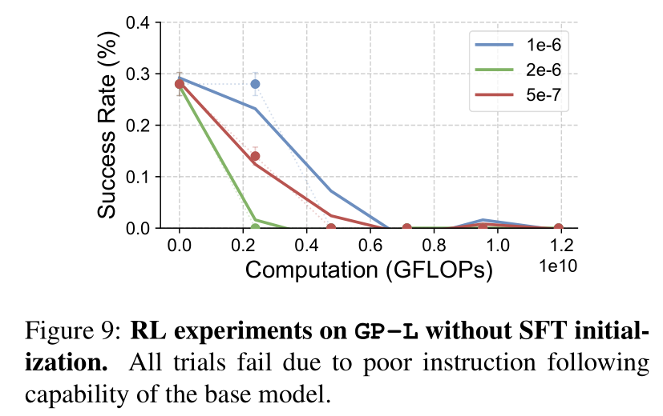
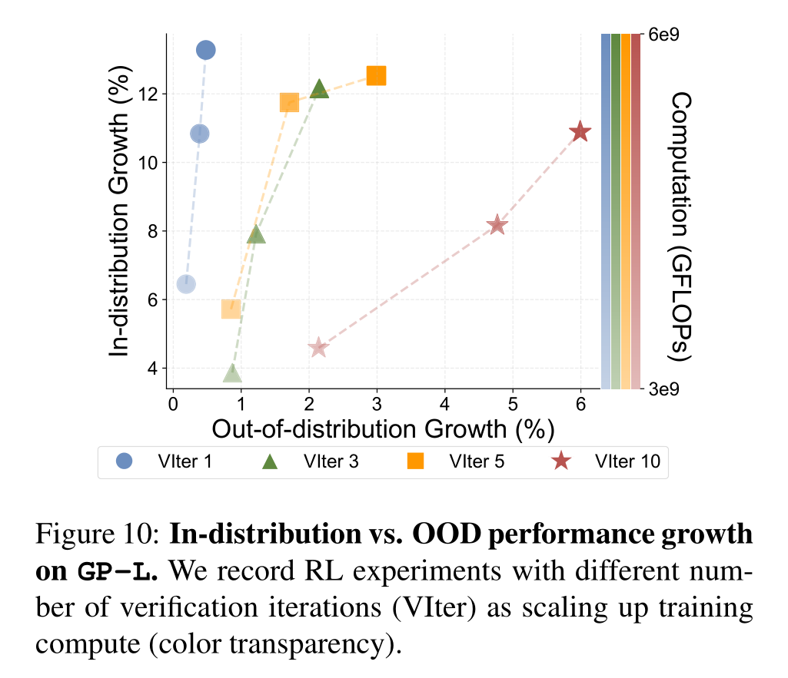

+++

title = "论文阅读：SFT Memorizes, RL Generalizes"

date = "2025-10-05"

[taxonomies]

tags = ["Machine Learning", "Fine-Tuning"]

+++

> Original Paper: [[2501.17161] SFT Memorizes, RL Generalizes: A Comparative Study of Foundation Model Post-training](https://arxiv.org/abs/2501.17161)

---

## Introduction

**Memorization and Generalization in LLM/VLM**: Memorization can manifest as the model memorizing the training data, while generalization reflects the divergence between the model's output distribution and the pre-training data distribution.

​

**Scaling up Inference-Time Compute**: Recent works demonstrate that fine-tuning verifiers during inference improves model accuracy. In addition, "scaling laws" for inference-time compute is revealed.

- We integrate inference-time verification into a multi-turn RL formulation.
- We examine the impact of inference-time verification on RL generalization.

> 在 RL 中使用 verifier，且发现增加推理时间/计算能显著提升泛化性。

---

## Evaluation Tasks

**The Generalization Points Environment**: This task is designed to evaluate generalization of arithmetic reasoning.

- State: Each state of the environment contains $4$ cards, described as text (in the GP-L variant) or presented as an image (in the GP-VL variant)
- Goal: The goal is to produce an equation that equals to a target number ($24$ by default).
- Rule Variations: We introduce rule variations to study whether the model learns or simply memorizes. These variations consist of interpreting the symbols <u>'J', 'Q', and 'K' either as '11', '12', and '13' respectively, or all as the same number '10'</u>. We <u>post-train the model using one rule, and evaluate using a different rule</u>.
- Visual Variations: Since the major visual challenge is to recognize the number of each card, agnostic to the color of the cards. We <u>train the model using cards of one color, then test OOD performance using the other color</u>.

​

**The V-IRL Environment**: We utilize the V-IRL environment to study spatial reasoning ability in an open-world navigation domain. We consider two versions of the environment, one (V-IRL-L) consists of pure language description, and another (V-IRL-VL) that includes vision-language input.

- Rule Variations: We consider two distinct action space. The first variant utilizes an <u>absolute orientation action space</u>, which includes 'north', 'northest',... The second variant employs a relative orientation action space containing 'left', 'right', 'slightly left' ...
- Visual Variations: The key visual challenge is to recognize landmarks from the visual observations. So we evaluate its performance in different locations.

​

---

## Results

**Experimental Setup**: We evaluate on `GeneralPoints`​ and `V-IRL`​, each of which has a pure language (-L) and a vision-language (-VL) variant. We consider the results on in-distribution (ID) and out-of-distribution (OOD) generalization.

- `GeneralPoints`: The ID case treats all 'J', 'Q', 'K' as 10, and the OOD cases interprets them as 11, 12, and 13.
- `V-IRL`: The ID case adopts the absolute orientation, and the OOD case uses the relative orientation.

**RL Generalizes, SFT Memorizes**: As shown in the figures, RL consistently improves OOD performance on all tasks. In contrast, SFT consistently exhibits performance degradation across all OOD evaluations on all tasks.

​

​

**RL Generalizes in Visual OOD Tasks**:

- `GeneralPoints`: We train the VLM using the black suits and test the OOD performance on the red suits.
- `V-IRL`: We train the model on routes collected in New York City and evaluate it on the original `V-IRL`​ VLN mini benchmark (containing routes from various cities world-wide).

​

**Scaling RL Improves Visual Recognition Accuracy in VLM Training**: We observe that VLM's visual recognition accuracy largely affects the overall performance. In addition, scaling up RL compute also improves visual recognition accuracy.

​

**SFT is Necessary for RL Training when the Backbone Model Does not Follow Instructions**: The figure shows that without SFT, all end-to-end RL runs fail to improve. We observe that without SFT, the base model suffers from poor instruction following capability.

​

**Scaling up Verification Improves Generalization**: We observe that RL generalizes better with more verification steps.

​
