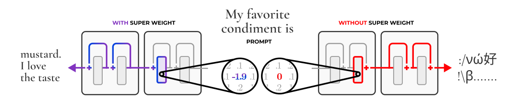
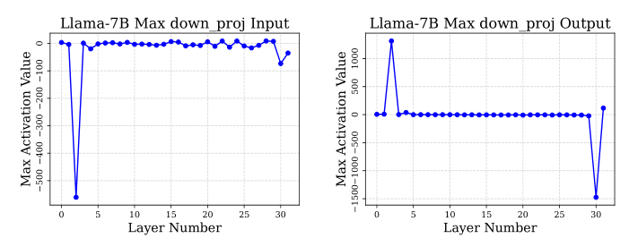
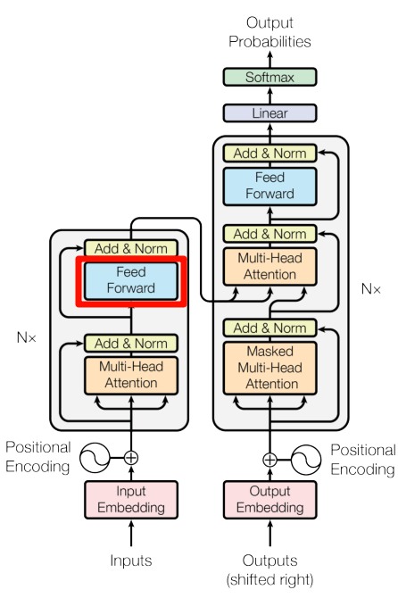
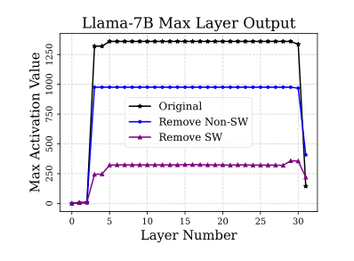
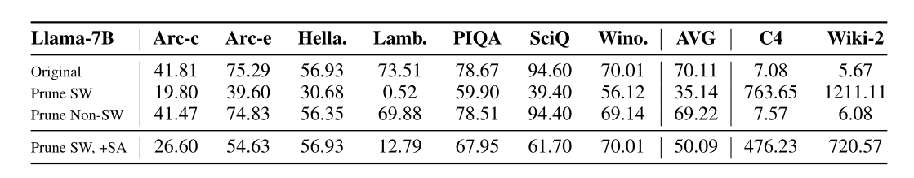
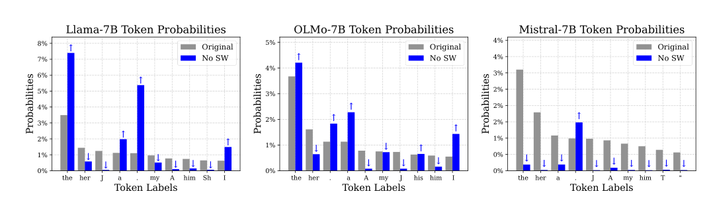
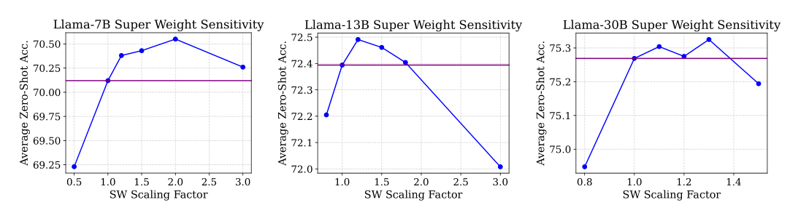
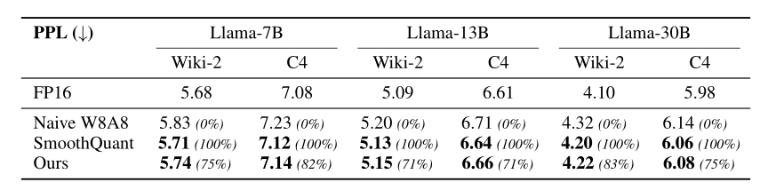
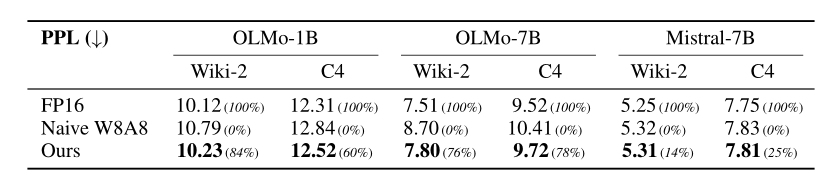
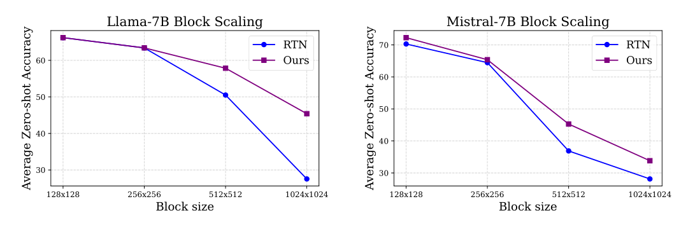

+++

title = "论文阅读：The Super Weight in Large Language Models"

date = "2025-09-06"

[taxonomies]

tags = ["LLM",  "Machine Learning"]

+++

> Original Paper: [[2411.07191] The Super Weight in Large Language Models](https://arxiv.org/abs/2411.07191)

---

## Introduction

**Large Outliers in Large Models**: Once LLMs reach a certain scale, a small set of hidden state features contains outliers of exceptionally large magnitude. These outliers account for a small percentage of all activations but are crucial for preserving the compressed model’s quality.

**Super Weights**: Not all large outliers are equally important. In this paper, we study a tiny yet important set of outliers in LLMs, termed *super weights*. In Llama-7B, pruning the super weight, a single scalar, completely destroys the model’s ability to generate text.

​

**Super Activations**: *Super activations* are exceptionally massive activations. They persist across many layers, feature constant magnitude, and always exist at the same position regardless of input.

​

**Super Weights behave similarly across model families and sizes**:

- They are always found in the `mlp.down_proj`​ weight.
- They produce exceptionally large magnitude activation--the *super activation*.
- They suppress stopword likelihood.
- Pruning the super weight destroys quality by <u>dampening the super activation</u>（super activation 几乎消失了） and <u>shifting almost all logit probability mass to stopwords</u>（几乎只输出 stopwords）.

 Super weights are often found in an early layer's down projection (2) Super activations are propagated through skip connections. (3) This has a effect of suppressing stopword likelihoods in the final logits.")​

> `mlp.down_proj`​：在 Transformer 架构中，Feed Forward 层（也就是 MLP 层）一般是两层神经网络，表示为 $\operatorname{FFN}(x) = W_2(\operatorname{ReLU}(W_1x + b_1)) + b_2)$，即先经过一个 `up_proj`​ 进行升维，一个 `activation`​ 进行非线性变换，再经过一个 `down_proj`​ 进行降维。
>
> ​
>
> Stopword 指的是那些非常常见，但是信息量很低的词，例如 `the`​、`a`​、`is`​、`of`​ 等。

**Super Outliers**: We refer to both super weights and super activations as *super outliers*, which are critical to model quality. Fortunately, there are no more than a handful of scalar super outliers per tensor.

---

## Contribution of This Work

**Super Weights**: We discover a tiny subset of outliers in LLMs, at most six scalars, that are disproportionately important; pruning these super weights destroys model quality.

**Identifying Super Weights**: We present a data-free way to identify super weights using only a single forward pass and provide an index of super weights for existing, open LLMs.

**Super Activations**: We analyze how super weights influence inference and relate them to the activation outliers observed in prior work.

**Compression**: By preserving super outliers, we show that round-to-nearest quantization increases effectiveness noticeably; preserving super outliers improves compression quality.

---

## Identification of Super Weights

**Super Weights Create Super Activations**: The super activations' channel (the position in vector) aligns with the super weights', and the activation first appears right after the super weights.

​

**The Mechanism behind Super Activations**: The Hadamard product of the `gate`​ and `up`​ projection creates a relatively large activation. The super weights further amplify it and create super activations.

> Gate 指的是对输入信息进行过滤和放缩的操作，假设 `A`​ 是输入向量；`g`​ 是与 `A`​ 等长的门向量，其元素在 `0~1`​ 之间。那么 gate 操作后的输出为 `B = A ⊙ g`​，其中 `⊙`​ 是逐元素（Hadamard）乘法。
>
> 虽然经典 Transformer 架构中的 FFN 层没有 gate 层，但是现代 Transformer，如 Llama、Mistral 等模型中有。

**Identifying Super Weight by Activation Spikes**: Super weights can be located by detecting the spikes in the `down_proj`​ inputs and outputs distributions across the layers. This dectection only requires a single input prompt, rather than a set of validation data or use-case examples.

**Identifying Steps**: Let $W \in \mathbb{R}^{D \times H}$ be the `down_proj`​ weight matrix, where $D$ is the dimension of the activation feature and $H$ is the intermediate hidden dimension. Let $X \in \mathbb{R}^{L \times H}$ be the input matrix, where $L$ is the sequence length. Then the output of `down_proj`​ is

$$
Y = XW^\top, \quad
\text{where} \quad Y_{ij} = \sum_{k=1}^d X_{ik}W_{jk}.
$$

Suppose $Y_{ij}$ is a super activation, $X_{ik}$ and $W_{jk}$ are outliers, then $Y_{ij} \approx X_{ik}W_{jk}$.

- Plot extreme outliers in the input and output activations of `mlp.down_proj`​.
- Determine the layer and coordinates of the super weights.
- Remove detected super weights and repeat the above process, until the magnitudes of large maximum activations are greatly suppressed.

​

---

## Mechanisms of Super Weights

**Super Weights (partially) Operate via Super Activations**: We want to assess the super weight's impact on model quality is solely mediated by super activations or other factors. We conduct experiments under three conditions:

- Original model
- Remove super weights (Prune SW): Set the weight scalar as zero.
- Remove super weights and restore super activation (Prune SW, +SA): Set the weight scalar as zero, and restore super activation at the layer where it first appears.

The results show that super activations contribute substantially to the model’s performance, they do not fully account for the super weight’s overall influence on quality.

​

**Super Weights Affect Output Token Probability Distributions**:

​

**Sensitivity of Super Weights**: We investigate how does increasing the magnitude of super weights affect model quality.

​

---

## Super-Outlier Aware Quantization

**Quantization**: The presence of outliers significantly degrade quantization quality. However, super outliers carry significant importance for model quality, making their preservation during  
quantization critical.

**Round-to-Nearest Quantization**: Here we consider the asymmetric round-to-nearest quantization

$$
Q(\mathbf{X})=\mathrm{Round}\left(\frac{\mathbf{X}-\mathrm{MIN}(\mathbf{X})}{\Delta}\right),Q^{-1}(\mathbf{\hat{X}})=\Delta\cdot\mathbf{\hat{X}}+\mathrm{MIN}(\mathbf{X})
$$

where $\mathbf{X}$ is the tensor to be quantized, $\mathrm{MIN}(\mathbf{X})$ is the smallest element in $\mathbf{X}$, and $\Delta=\frac{\mathrm{MAX}(\mathbf{X})-\mathrm{MIN}(\mathbf{X})}{2^{N-1}-1}$ is the quantization step with $N$ being the number of bits. So super outliers in $\mathbf{X}$ drastically increase the step size, increasing the quantization error.

> 量化步长 $\Delta$ 衡量了量化后两个相邻离散值之间的距离，可以类比于图像的分辨率。假设 $\mathbf{X}$ 中大部分值都在 $[-1.0, 1.0]$ 区间内，突然出现了一个超大的离群值（outlier），这会导致量化步长 $\Delta$ 激增，从而导致精度下降严重。

**Solution to Outlier Quantization**:

- Hold out the super outlier to prevent adverse effects on inlier quantization.
- Restore the super outlier's value after dequantization.

**Activation Quantization**: We replace the super activation with the median, then quantize, dequantize and restore it.

$$
\hat{A}=\mathrm{RESTORE}(Q^{-1}(Q(\mathrm{REPLACE}(A)))
$$

**Weight Quantization**: First, we identify super weights. Second, we clip the outlier weights, quantize, and dequantize the clipped weights. Third, restore the half-precision super weights after dequantization.

$$
\hat{W}=\mathrm{RESTORE}(Q^{-1}(Q(\mathrm{CLIP}_z(W)))
$$

We parameterize clipping using a z-score.

> z-score 方法来自于统计学，给定一个阈值 `z`​，其衡量每个元素偏离平均值的程度。一旦某个元素的偏离值超过阈值 `z`​，则会被视作离群值。上面的 `CLIP`​ 操作即将离群值裁剪掉。

​

---

## Experiments

We first evaluate the perplexity (PPL) of different quantization method for Wiki-2 and C4.

​

We also evaluate the accuracy on zero-shot benchmarks.

​

> Block size 是量化中的一个概念，指的是为了更好地适应 weight tensor 的局部变化，将大的 weight tensor 切割为多个小块独立进行量化
>
> - 大 Block Size：量化粗超，但是高效
> - 小 Block Size：量化精细，但是计算和存储开销大
