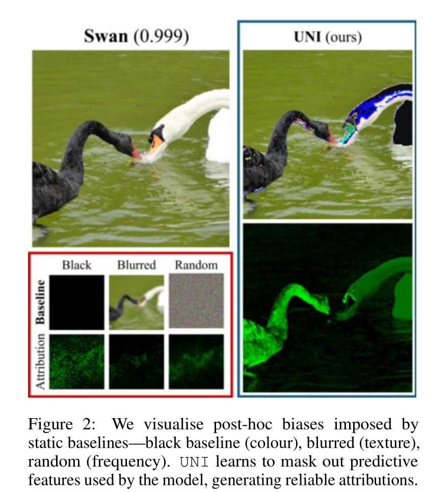
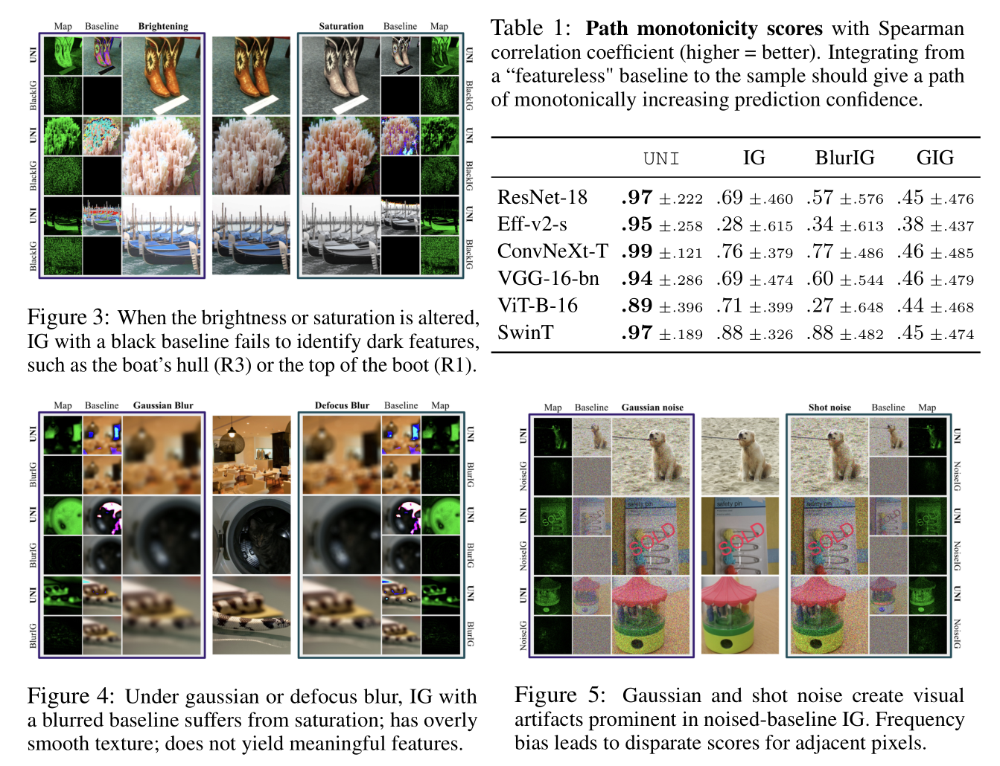
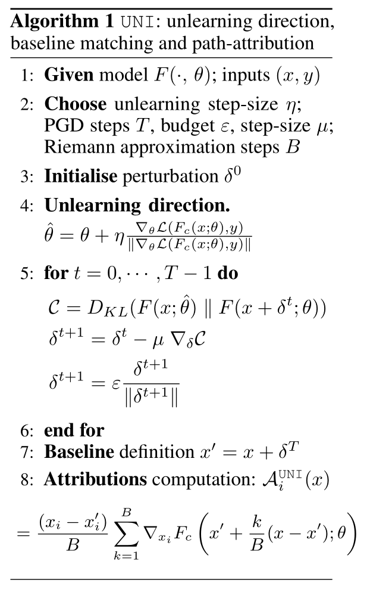
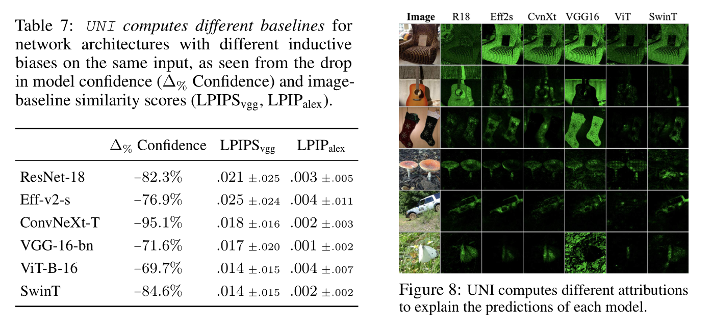
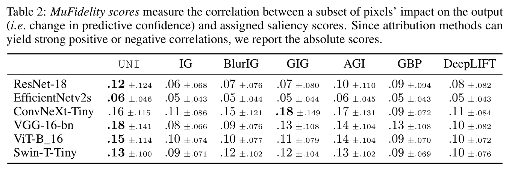
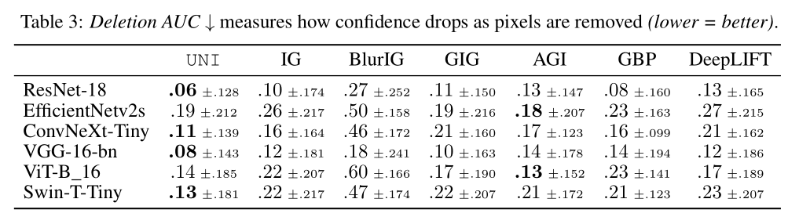
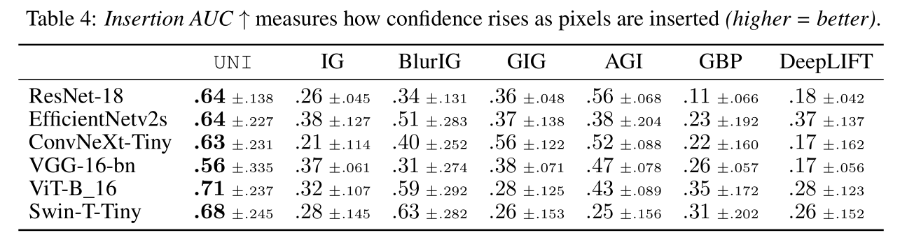
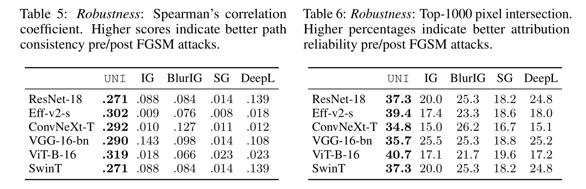
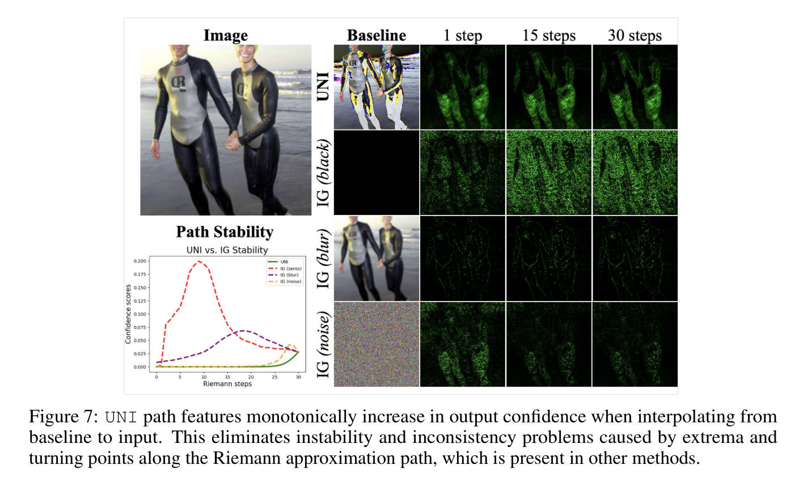

+++

title = "论文阅读：Unlearning-Based Neural Interpretations"

date = "2025-10-04"

[taxonomies]

tags = ["Machine Learning"]

+++

> Original Paper: [[2410.08069] Unlearning-based Neural Interpretations](https://arxiv.org/abs/2410.08069)

‍

---

## Introduction

**Machine Unlearning**: Unlearning concerns "forgetting" of a data-point for a trained model:

- Exact Unlearning: Seeks indistinguishability guarantees between a model not trained on a sample and one that has unlearned. Provable exact unlearning is <u>only achieved under full re-training</u>.
- Approximate Unlearning: Unlearns with first/second order gradient updates, achieving max-divergence bounds for single unlearning samples.

**Perturbative Methods**: Perturb inputs to change and explain outputs. These methods fail to give a global insight of the model's decision function and are <u>highly unstable due to the reliance on local perturbations</u>. Different methods give <u>incongruent explanations</u> which cannot be acted on.

> 因为局部扰动而高度不稳定，不同解释方法给出完全不同的解释。

**Backpropagative Methods**: These methods leverage <u>gradients of the output w.r.t. the input</u> for some given neuron activity of interest. However, gradients are <u>highly noise and locally sensitive</u>, they can only <u>crudely localize salient feature regions</u>.

> Salient feature region 表示重要特征的部分，梯度噪声很大，且只能粗略定位

**Path-Based Attribution**: This family of post-hoc attributions rely on a <u>baseline</u> -- a "vanilla" image devoid of features, and a <u>path</u> -- an often linear path from the featureless baseline to the target image. However, it comes with difficulties of defining an <u>unambiguously featureless baseline</u> and a <u>reliable path of increasing label confidence</u> without intermediate inflection points.

> Post-hoc 表示事后的

---

## Notation

- Input/Feature Space: $\mathcal{X}\subset\mathbb{R}^{d_X}$, where $d_X$ is the number of pixels in an image.
- Output/Label Space: $\mathcal{Y}\subset\mathbb{R}^{d_{Y}}$, where $d_Y$ is the number of classes.
- Model Space: $\mathcal{F}\subset\mathcal{Y}^{\mathcal{X}}$, and $F:x\mapsto(F_{1}(x),...,F_{d_{Y}}(x))$, where $F_c(x)$ is the probability score of class $c$.
- Attribution Methods: $\mathcal{A}: \{1,...,d_{X}\}\times\mathcal{F}\times\{1,...,d_{Y}\}\times\mathcal{X}\to\mathbb{R}$, where $\mathcal{A}(i,F,c,x)$ is the importance score of pixel $i$ of image $x$ for the prediction made by $F_c$. For convenience, we use the shorthand $\mathcal{A}_i(x)$ to refer to the attributed saliency score of a pixel $i$ for a specific class $c$.
- Linear Path Feature: $\gamma(x^{\prime},x,\alpha):\mathbb{R}^{d_{\mathcal{X}}}\times\mathbb{R}^{d_{\mathcal{X}}}\times[0,1]\to\mathbb{R}^{d_{\mathcal{X}}}$, where $\gamma=(1-\alpha)x^{\prime}+\alpha x$ and employ shorthands $\gamma(0)=x^{\prime},\gamma(1)=x$.

---

## Limitation of Existing Gradient-Based Methods

**Limitation of Simple Gradient**: The simple gradient $\mathcal{A}_{i}^{\mathrm{SG}}(x)=\nabla_{x_{i}}F_{c}(x)$ can be effciently computed but it <u>encounters output saturation</u> when activation functions like ReLU and Sigmoid are used, leading to <u>zero gradients even for important features</u>.

**DeepLIFT**: DeepLIFT reduces saturation by introducing a "reference state" and <u>comparing each neuron's activations to that of the baseline</u>.

**Integrated Gradients (IG)** : Integrated gradients similarly utilizes a reference, <u>black image</u> and computes the integral of gradients interpolated on a straight line between the image and the baseline:

$$
\mathcal{A}_{i}^{\mathrm{IG}}(x)=(x_{i}-x_{i}^{\prime})\int_{\alpha=0}^{1}\nabla_{x_{i}}F_{c}\left(x^{\prime}+\alpha(x-x^{\prime})\right)\mathrm{d}\alpha
$$

where $(x_{i}-x_{i}^{\prime})$ is the difference between the real pixel and the baseline pixel, and $x^{\prime}+\alpha(x-x^{\prime})$ is the line interpolation.

**Limitation of IG**: The soundness of IG depends on two assumptions--a <u>baseline represents the "absence" of predictive features</u>, and <u>has stable path features</u>.

- Research suggests that when a black image is used, the <u>path features are ambiguous</u>, where extrema of the model confidencs lie along the integration path instead of at the endpoints of the baseline.
- Models trained with image augmentations (e.g., color jittering, rescaling, gaussian blur) yield equivalent or <u>even higher confidences for blurred and lightly-noised baselines</u>.

> 两个核心假设：（1）黑色图片真的什么特征都不表示（2）从黑图渐变到真实图片过程中，模型的信心是单调递增的

**Post-Hoc Biased are Imposed**: Static baseline functions (e.g., black, blurred, noised) implicitly assume that <u>similar features (e.g., dark, smooth, high-frequency) are irrelevant for model prediction</u>. For example, IG with a black baseline implies that "near-black features are unimportant", since the term $(x_i-x_i^\prime)$ is small and requires a large gradient $\nabla_{x_i} F_c(\cdot)$.

**Experiments**: The color biases are not present naturally in the pre-trained model but rather injected implicitly by a suboptimal choice of static baseline.

- Figures 2, 3: Darker features belonging to the object-of-interest cannot be reliably identified.
- Figure 4: IG with a blurred baseline fails to attribute blurred inputs due to saturation and overly smoothed image textures.
- Figure 5: Visualize how a noised IG baseline encounters high-frequency noise and outputs irregular, high-variance attribution scores.

​

​

---

## UNI: Unlearning-Based Neural Interpretations

**Desirable Baseline**: For every given task-model-image triad, a well-chosen baseline should be:

- Image-Specific: Be connected via a <u>path feature of low curvature (smooth) to the original image</u>, rather than unchanged black images.
- Reflect only the model's Predictive Biases: <u>Salient image features should be excluded</u> from the baseline.
- Less Task-Informative than the Original Image: Interpolating from the baseline towards the input image should yield <u>a path of increasing predictive confidence</u>.

**UNI Pipeline**: 

1. Unlearn predictive information in the model space
2. Use activation-matching between unlearned and trained models to mine a featureless baseline in the image space
3. Interpolate along the low-curvature, conformant and consistent path from baseline to image to compute reliable explanations in the attributions space

> 第一步：反学习，让模型忘掉怎么识别特定图片，生成一个针对特定图片的【失忆模型】。具体的方式是做【梯度上升】。
>
> 第二步：使用【激活值匹配】，生成一张图片，使得【原版模型的激活值】和【失忆模型的激活值】相同，作为 baseline。具体的方式是不断地寻找图片，计算【原模型和失忆模型的 KL 散度】，然后做【梯度下降】。
>
> 第三步：在 baseline 和原始图片中插值，获得光滑的路径。

​

​

**Desirable Path Features**: 

- Proximity (邻近性): We aim for a smooth transition between absence and presence of features, and this intuitively cannot be achieved if the baseline and input are too far away. In UNI, we bound the distant $\|x - x^\prime\|$ to a certain value $\epsilon$.
- Low Curvature: Assume that the function $g:\alpha\in[0,1]\mapsto {\nabla}F_{c}\left(x^{{\prime}}+\alpha(x-x^{\prime})\right)$ is $\mathcal{C}^1$ on the segment $[x^\prime, x]$, the error in the Riemann approximation of the attribution is

$$
\left|(x_i-x_i^{\prime})\int_{\alpha=0}^1g\left(\alpha\right)d\alpha-\frac{(x_i-x_i^{\prime})}{B}\sum_{k=1}^Bg\left(\frac{k}{B}\right)\right|\leq\frac{M||x-x^{\prime}||^2}{2B}
$$

where the lhs indicates the numerical integration error, while $M$ is proportional to the curvature, and $B$ is number of steps. A lower value of the constant $M$ implies a lower error in the integration calculation.

- Monotonic: Intuitively, the path from the "featureless" baseline to the input image should be monotonically increasing in output class confidence. The unlearning mechanism naturally meets this condition.

‍

 shows the model after one gradient ascent step on the datapoint (2,5). (b) shows the model trained on the three datapoints. The path between UNI baseline and the image is highlighted by arrows in (b).")​

---

## Experiments

**Faithfulness**:

- We report the MuFidelity scores, i.e., the faithfulness of an attribution function $\mathcal{A}$, to a model $F$, at a sample $x$, for a subset of features of size $|S|$, given by

$$
\mu_{f}(F,\mathcal{A};x) = 
\mathrm{corr}_{S\in
\begin{pmatrix}
[d] \\
|S|
\end{pmatrix}}\left(\sum_{i\in S}\mathcal{A}(i,F,c,x),F_{c}(x)-F_{c}(x_{[x_{s}=\bar{x}_{s}]})\right)
$$

> $\sum_{i\in S}\mathcal{A}(i,F,c,x)$ 为归因方法的【预测重要性】，$F_{c}(x)-F_{c}(x_{[x_{s}=\bar{x}_{s}]})$ 为像素的【实际影响力】

​

- We also report deletion and insertion scores, which measures the decrease (deletion) or increase (insertion) of a model's output confidence as salient pixels are removed or inserted.

​

​

**Robustness**: We design norm-bounded attacks to miximize the disagreement in attributions while constraining the prediction label unchanged.

$$
\begin{gathered}
\delta_{f}^{*}=\operatorname{arg}\operatorname*{max}_{\|\delta_{f}\|_{p}\leq\varepsilon_{f}}\frac{1}{d_{X}}\sum_{i=1}^{d_{X}}d\left(\mathcal{A}(i,F,c,x),\mathcal{A}(i,F,c,x+\delta_{f})\right) \\
\mathrm{subject~to}\quad\arg\operatorname*{max}_{c^{\prime}}F_{c^{\prime}}(x)=\arg\operatorname*{max}_{c}F_{c^{\prime}}(x+\delta_{f})=c
\end{gathered}
$$

> 热力图的鲁棒性指的是当输入图片增加一个微小到人眼无法识别的变化时，好的解释方法的热力图保持稳定。这里采用了对抗攻击（adversarial attacks）的方法，在不改变模型最终预测结果的前提下，最大化改变归因热力图。
>
> Table 5 展示了攻击前和攻击后两个热力图的相关性
>
> Table 6 展示了攻击前最重要的 1000 个 pixel 和攻击后的重合比例

​

**Stability**: We compare UNI and other method's sensitivity to Riemann approximation noise

> IG 类方法从 baseline 出发通过多个 step 到达原始图片，理论上 step 越多越精确，但如果不稳定，则【走多少步】和【从哪个 baseline 出发】会影响最终热力图结果。

​
